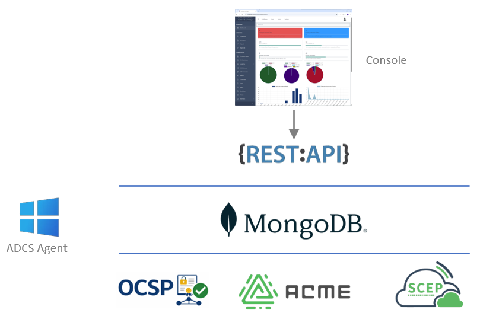
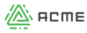
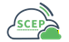

# Certdog Architecture

The certdog application is made up of the following main components:

 

The components are broadly independent and can therefore be run on separate servers/containers, which is the case when deployed as a Kubernetes cluster

 

###  The Console (User Interface) 

A web based front end that allows for system configuration and the management of certificates (requesting, searching, revoking etc.)  

It allows users and administrators to login and perform operations. Available operations are dependant on what privileges the logged in user has e.g. a standard user will not have any administrative (e.g. user management) operations available  

The UI performs very little processing. All operations are handed off to the API making it a lightweight component. This this also means that everything that you can do via the UI can be done via the REST API  

 

###  The REST API 

This is available to all users who have a valid logon. That is, if they can authenticate to the UI they can make use of the REST API  

Available operations can be viewed using the Swagger interface that can be accessed at this location:

https://[servername]/certdog/api/swagger-ui.html

E.g.

[https://127.0.0.1/certdog/api/swagger-ui.html](https://127.0.0.1/certdog/api/swagger-ui.html)

If you wish to develop your own applications that make use of certdog features, you should develop against this API

 

###  The ACME Service

This provides the ACME interface. It is configured via the Console (or REST API) but operates as its own service

 

###  The SCEP Service

This provides the SCEP interface. As for ACME it is also configured via the Console but operates as a separate service

###  OCSP and CRL Services

The OCSP and CRL services provide the revocation checking capabilities for the internal local CAs.

 

###  The Database 

Certdog uses a mongo database which offers speed and flexibility. For example, you may host your database locally (the default), on a separate server or in the cloud (MongoDB Atlas) 

You can use a dedicated instance or use an existing instance you already have in place

If any other components are updated, there is usually no need to also update the database

There are several simple mechanisms for backing up the data 

Sensitive data stored in the database is encrypted by the API service before being stored

###  The ADCS Agent

This is the component that interfaces with the Microsoft CA (Active Directory Certificate Services)  

It communicates directly with the database to increase performance. This means that as soon as a request is placed, the database can push the request to the agent for immediate processing. 

 

By default all communication between the components is protected via TLS

