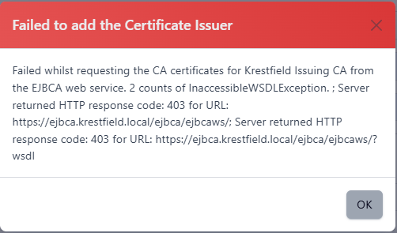

# Create an EJBCA Issuer

To configure certdog to be able to request certificates from EJBCA, the following is  required:

* The Web Service option is enabled in EJBCA
  * You can check this from Admin Web. Choose System Configuration then click the Protocol Configuration tab. the Web Service option should be *Enabled*
* A User KeyStore
  * This is an end-entity certificate issued from EJBCA's current ManagementCA that is configured to have access to the RA administrative functions
  * This is the certificate that certdog will use  to authenticate to the EJBCA RA.  You must obtain this as a JKS (Java Key Store) file from EJBCA
* A certificate profile must be configured to allow *Subject DN Override by CSR* and *Allow Extension Override*. See [EJBCA - Sample TLS Certificate Profile](ejbca_sample_tls_profile.html) fore more details
* An end-entity profile must be configured with no subject DN attributes and set to allow *User Generated* tokens. See [EJBCA - Sample End Entity Profile](ejbca_sample_end_entity_profile.html) for more details

### 1. Obtaining the User KeyStore

If you are already familiar with EJBCA and issuing certificates for administrator access, skip this section and just ensure that you obtain a password protected JKS with a certificate that has RA Administration privileges

There are several ways in which this can be obtained e.g. via the Admin Web console, the RA (Registration Authority) console or the CLI (Command Line Interface). The following details the RA process  

Log on to the **RA console**

Click **Enroll** and select Make New Request

The above shows some initial default settings, but there may be specific certificate and end-user profiles configured for this purpose (that limit available options)

For Key-pair generation, select **On server**  

Choose an **algorithm**. Note: With the default profiles, you have access to all algorithms, if unsure which to choose, consult with your security personnel, though **RSA 2048 bits** is a common choice

For the *Subject DN Attributes*, enter a common name e.g. **certdog** and scroll down

In the *Provide User Credentials* section, enter a **username** and for **Enrollment code** - just enter a password

You can leave *Email* empty

Scroll down to the *Confirm request* section and click **Download JKS**

Save this **file** and retain the **username** and **password** (Enrollment code) entered above - these are required for the certdog configuration  

### 2. Set Administrator Permissions

From the RA, select **Role Management** and click **Roles**. If you have already configured a role which only allows RA administrator access you may use this, otherwise, click **Create New Role**

For the Role name, enter a name for this role e.g. Certdog RA Administrators

For the *Certificate Authorities*, add those that you wish to issue certificates from certdog

Select *all End Entity* permissions

For *End Entity Profiles*, add those profiles that you want to be applied for certificates issued from certdog. See the [EJBCA - Sample End Entity Profile](ejbca_sample_end_entity_profile.html) for an example   

Click **Add**

From the list, click **Members**

Just click **Add Role Member**

For CA, select **ManagementCA**, select **Match with Serial Number (recommended)** then paste in the **certificate serial number** in the *Match Value* and click **Add**. This is the serial number of the certificate created in [step 1](#Obtain the User KeyStore) above

Note: You can obtain this serial number by choosing **Search** in the RA, then click **Certificates**  and type the certificate name (e.g. certdog). Copy the serial number and paste into the **Match Value** above

From the administrative console (/adminweb), under **System Functions**, select Administrator Roles

Locate the role (e.g. Certdog RA Administrators) and select **Access Rules**

For the *Role Template*, ensure it says **RA Administrators**, select it if not. Check CAs selected are as required and click **Save**

### 3. Certificate Profile

Whichever profiles you wish to use with certdog - you must **check** the **Allow Subject DN Override by CSR** and **Allow Extension Override** options. For details on how to configure a sample profile for TLS, see [EJBCA - Sample TLS Certificate Profile](ejbca_sample_tls_profile.html)

### 4. End Entity Profile

It is recommended that a new End Entity profile be created for certdog. Ensure that under the *Main certificate data* section, the **User Generated** option is selected in *Available Tokens*. This is because certdog will be generating the CSRs (or they will be provided)

For an example on setting up an end-entity profile, see [EJBCA - Sample End Entity Profile](ejbca_sample_end_entity_profile.html)

## certdog Configuration

Before starting this, ensure you have the following:

* The **Web Services URL**
  * This will be in this form: https://hostname/ejbca/ejbcaws/ejbcaws
    * Note that the **ejbcaws** part is repeated
  * E.g. https://ejbca.org.local/ejbca/ejbcaws/ejbcaws
  
* The **user JKS file** and its password
  * As created in step 1 above

* The **name of the CA** you wish to issue certificates from e.g. Certdog Issuing CA
* The name of the **Certificate profile** you wish to configure

* The name of the **End Entity profile** you wish to configure

* If an un-trusted TLS certificate is used to protect the RA Web Services URL, you will also need to download the JKS for the CA that issued this certificate - this will be the **Trust KeyStore**
  * This can be obtained by navigating to the **RA Web**, selecting **CA Certificates and CRLs** from the top menu then downloading the *Certificate chain* as **JKS** for the CA. You will need to provide a password that will protect this JKS - this will be required in the configuration below.

### Set Credentials

First we need to set some credentials. Credentials are password stores that are then referenced by a name. We will need one for the User KeyStore (JKS file) and optionally, one for the Trust KeyStore

From the certdog menu, select **Credentials** and select **Add New Credential**

For *Credential Type*, select **Password**

Choose a name then enter the password. Note for the User KeyStore, this password will be the one you set in step 1 above when enrolling for the certificate

Click **Add**

If required, create another credential for the Trust KeyStore (i.e. the keystore downloaded from the CA). This default password for this keystore will be displayed by EJBCA when you download

### Configure EJBCA Issuer

From the certdog menu, select **Certificate Issuers** and select **Add New Issuer**

For the *CA Type*, select **PrimeKey EJBCA** and click **Next**

Enter the details as follows:

* **Name**: This is the name you will refer to this issuer, it has nothing to do with what has been configured in EJBCA and can be a name of your choice
* **Web Services URL**: The EJBCA Web Services end point. E.g. https://hostname/ejbca/ejbcaws/ejbcaws
* **Trust KeyStore**: Only required if the certdog system does not already trust the TLS certificate protecting the EJBCA end point. If required, browse to the JKS file downloaded from the RA Web.
* **Trust KeyStore Credential**: Select the credential created in *Set Credentials* section above
* **EJBCA Username**: Enter the username from step 1 above. I.e. the username of the end-entity
* **User KeyStore**: Browse to the User KeyStore created in step 1
* **User KeyStore Credential**: Select the credential created in the *Set Credentials* section above
* **EJBCA Issuing CA Name**: This is the name of the CA configured in EJBCA that you wish to issue certificates from
* **End Entity Profile Name**: The name of the end entity profile. See step 4 above.
* **Certificate Profile Name** The name of the certificate profile. See step 3 above.
* **DN Restriction**: If you wish to restrict the DNs from certdog (this can also be done from EJBCA), select the *DN Restriction* here
* **Authorise Teams**: Finally, select the Team(s) whose members will have access to this issuer

Click **Add**

If all is correct you will get a success confirmation. If any of the details or are incorrect you may get errors such as:

Receiving a 403 error often indicates hitting the wrong URL or wrong path. 

This may be due to entering an incomplete URL. Note: although the EJBCA Admin page (under Protocol Configuration) shows ``/ejbca/ejbcaws`` indicating a URL such as 

``http://ejbca.krestfield.local/ejbca/ejbcaws`` 

the full URL contains two ``ejbcaws`` entries. I.e. 

``http://ejbca.krestfield.local/ejbca/ejbcaws/ejbcaws``

This error is most likely due to the User Key Store password being incorrect.  Reset the password in the credential and try again

The most likely cause is that the certificate included in the User KeyStore does not have RA Administrative permissions. Go back to EJBCA and check the Administrator Roles

The Web Service URL is most likely protected with a TLS certificate that is not trusted.  Identify the CA that issued the TLS certificate and download its certificate chain as a JKS - then upload as outlined above

