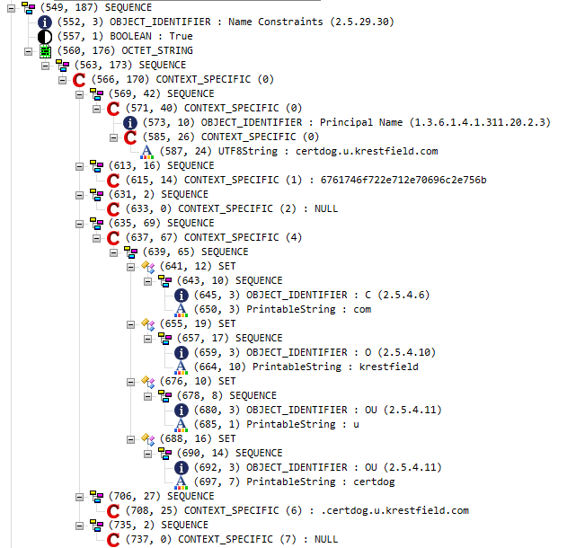
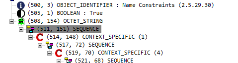

# Creating Custom Extensions Data

<br>

> This section requires some low level data manipulation. Contact [krestfield support](mailto:support@krestfield.com) if any assistance is needed to create the required data
>
> This functionality is available from version 1.10 onwards

<br>

A custom certificate extension can be added to a certificate profile. To add a custom extension you require the OID (Object Identifier), whether the extension should be marked critical or not and the data for the extension  

This data must be the ASN.1 encoded data for the extension, containing all elements as required by that particular extension  

To examine what ASN.1 elements may be required for a particular extension, you could refer to [RFC 5280](https://datatracker.ietf.org/doc/html/rfc5280). For example, for Name Constraints, the required ASN.1 is detailed as:

```
id-ce-nameConstraints OBJECT IDENTIFIER ::=  { id-ce 30 }

NameConstraints ::= SEQUENCE {
   permittedSubtrees       [0]     GeneralSubtrees OPTIONAL,
   excludedSubtrees        [1]     GeneralSubtrees OPTIONAL }

GeneralSubtrees ::= SEQUENCE SIZE (1..MAX) OF GeneralSubtree

GeneralSubtree ::= SEQUENCE {
   base                    GeneralName,
   minimum         [0]     BaseDistance DEFAULT 0,
   maximum         [1]     BaseDistance OPTIONAL }

BaseDistance ::= INTEGER (0..MAX)
```

If you are fluent in building ASN.1 you can craft the required data. However, it is sometimes easier to take the data from another similar certificate, edit it as required, then set this as the new extension's data  

In this example we will build a Name Constraint extension using this method  

<br>

## 1. Obtain example data 

Locate a certificate with an extension with data as similar to what you require  

Open the certificate in an ASN1 editing tool e.g. [ASN.1 Editor](https://www.pkisolutions.com/tools/asn1editor/)  

Locate the extension:



Edit the values in this editor as required  

Now click on the **SEQUENCE** section:



And choose **Save selected node as...** and save to a file  

Open this file using a HEX editor or similar that can convert binary data to an ASCII HEX string e.g. [Free Hex Editor Neo](https://www.hhdsoftware.com/free-hex-editor). In this tool you can simply select all and copy  

This data is your new extension's ASN.1 data and should be provided as the *Data* element when adding the custom extension  

