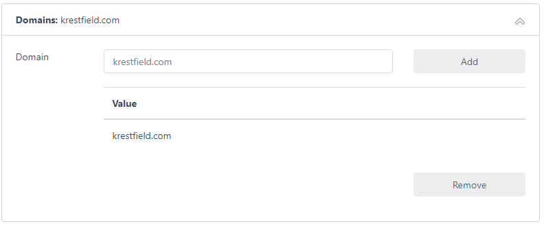
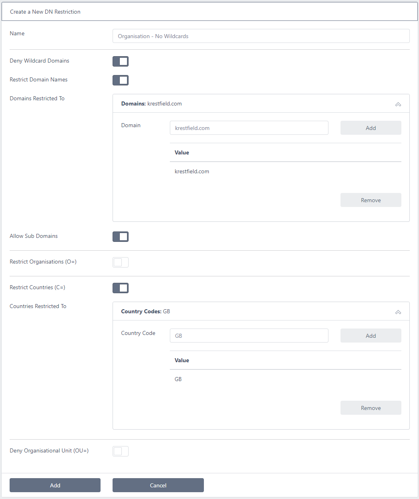

# Certdog - DN Restrictions

> From version 1.9

The requested DN (Distinguished Name) can be restricted such that only permitted DNs can be issued from a Certificate Issuer  

A DN Restriction can be created which will include rules such as what domain names can be requested or which country codes are permitted etc. These restrictions can then be applied to one or more Certificate Issuers  

To create a DN Restriction, click on the **DN Restrictions** menu item and click **Add New DN Restriction**  

Enter a name for the restriction set  

The following items are then available

* **Deny Wildcard Domains**

  * If checked domain names including '*' are not permitted in either the CN (Common Name) field or the DNS SAN (Subject Alternative Names) entries. For example, if this option is checked a DN of ``CN=*.krestfield.com`` would be rejected 

* **Restrict Domain Names**

  * If this item is checked then you may specify an *allow list* of domains. To do this click on the following panel:

    

  * Enter the domain you wish to be permitted and click **Add**:

    

  * You may add multiple domains

  * If you wish to remove any, select them and click **Remove**

  * The domains you entered will be allowed - no others will be permitted

  * However, you may permit sub-domains of the specified domains. For example, if you specified ``krestfield.com`` as a permitted domain and wished to allow any sub-domains of ``krestfield.com`` (including ``site1.krestfield.com``, ``site2.krestfield.com`` etc.), check the **Allow Sub Domains** option. Note that the *Deny Wildcard Domains* option will still override wildcards in any sub-domains

* **Restrict Organisations**

  * If this option is selected you may enter permitted organisations
  * Click the panel to add and remove organisations

* **Restrict Countries**

  * If this option is selected you may enter permitted country codes such as ``GB``, ``US`` and ``DE``
  * Click the panel to add and remove countries

* **Deny Organisational Unit**

  * If this option is selected, the OU field will not be permitted
  * This may be used to support the CA/B Forum ballot [SC47V2](https://cabforum.org/2021/06/30/ballot-sc47v2-sunset-subjectorganizationalunitname/)

Once all items have been entered, click **Add**

This restriction can now be applied to a Certificate Issuer
