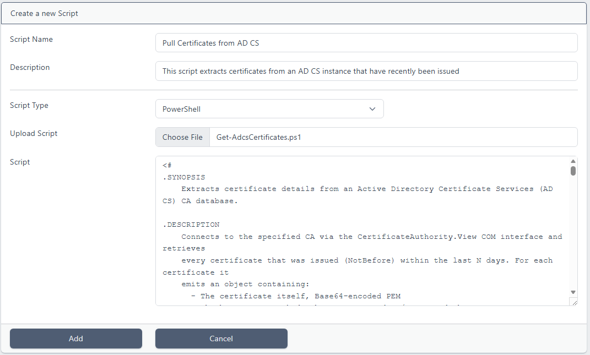
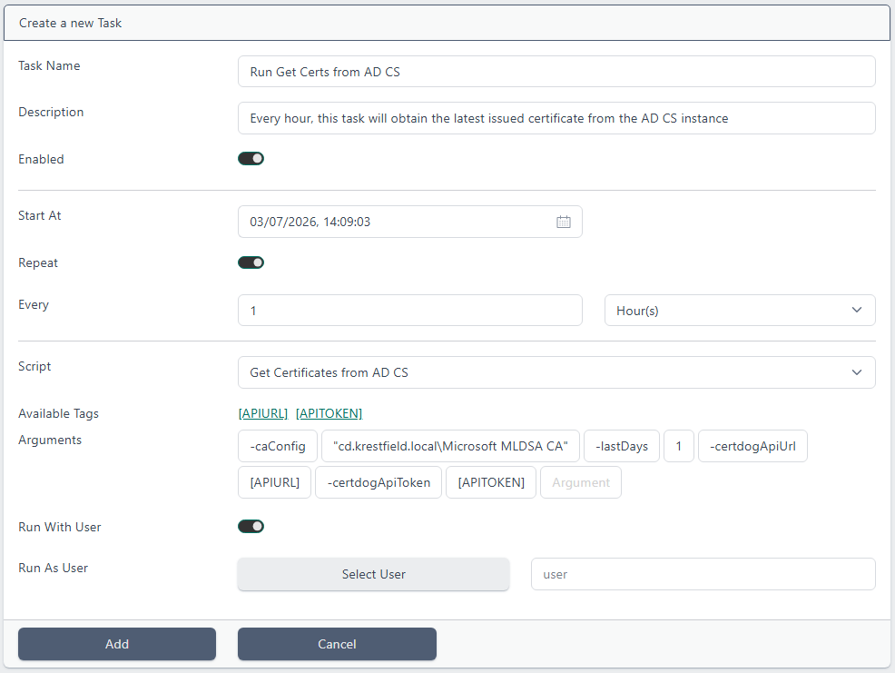

# Importing Certificates from AD CS

> From version 1.17

<br>

Certificates issued from Active Directory Certificate Services can continually be pulled into the certdog database using the Scripts functionaity.

<br>

## Configuration

From the **Scripts** menu click Add New Script



For *Script Name*, enter a name, such as **Get Certificates from AD CS**

Optionally, enter a description

For *Script Type*, choose **PowerShell**

Click **Choose file** and navigate to

```powershell
.\certdog\scripts\Get-AdcsCertificates.ps1
```

and click **Add**

<br>

From the Tasks menu, click Add New Task



Enter a **Task Name**, such as *Run Get Certs from AD CS*

Optionally enter a description

For *Start At*, choose when you want the script to first start running. Leaving at the defaults will allow the script to begin immediately. If you choose a time in the future and do not click *Repeat*, the task will run once

<br>

For the first run, if you wish to import ALL of the certificates in AD CS (as you do not currently have any inventory and wish to track it), choose a time in the future and leave the **Repeat** option *unchecked* and set the *lastDays* parameter below to the time when the first certificates were issued 

OR if you do not want to import expired certificate, a value that indicates the longest lifetime of any certificates issued from the CA. E.g. if the longest lived certificates have a two year lifetime, then set *lastDays* to **730** (365 * 2)

Once all certificates are in the certdog database, you can then check the *Repeat* option and reduce the *lastDays* time down (to something like every hour or every day). This will continually synchronise with the CA database and pull in all newly issued certificates

<br>For *Script*, select the script we added above from the Dropdown e.g. **Get Certificates from AD CS**

The available arguments are:

* caConfig
  * This should be the config (as returned when running certutil and in the form "server\CA name") of the AD CS instance being targeted
* lastDays
  * The number of days prior to search for new certificates. For an initial run, set this to when the first certificates were issued (to import all certificates). From then on, set to a lower value. Note that any certificates already imported will not be re-imported
* certdogApiUrl
  * The URL to the certdog API. This will be passed in using the [APIURL] tag as part of the Scripts functionality
* certdogApiToken
  * The API token that authenticates to certdog API. This will be passed in using the [APITOKEN] tag as part of the Scripts functionality

Enter these as arguments as shown in the image. e.g.

```powershell
-caConfig "cd.krestfield.local\Microsoft MLDSA CA" -lastDays 1 -certdogApiUrl [APIURL] -certdogApiToken [APITOKEN]
```

<br>

Check the **Run With User** option which is required if ``[APITOKEN]`` is used, as this decides from what user the API token will be created from. This results in the calls made using this token being from that user account

For *Run as User*, click **Select User** and choose the **user**

Click **Add**

<br>

## Monitoring

When the script runs, monitor the text logs ``.\certdog\logs\certdog.log`` 

This will show the output from the script. 

For each new certificate imported you will see entries such as:

```
Importing Request ID 29...
Imported OK
```

You should see these initially as new certificates are discovered. For subsequent runs you may see entries such as:

```
Import-Certificate failed: The remote server returned an error: (409) Conflict.
WARNING: Error details: @{timestamp=2026-07-03T13:45:37.866+00:00; status=409; error=Conflict; message=Failed to import
 certificate. 409 CONFLICT "The certificate is already present in the system. Details: id: 6a47bcc51f41a9ebeba00cde,
owner: admin, team id: 6a3e42367257c590581e2621"; path=/certdog/api/certs/import}
```

This is just indicating that an attempt was made to re-import a certificate that is already in the system and is not an error as such

Note that if an attempt is made to re-import a certificate, if it has subsequently been revoked, this status will be updated in certdog

<br>

## Tips

Consider how often you need the certdog database to be updated and synchronised with the Microsoft AD CS instance. For example, if you are using certdog as an expiry tracker, you may only need to import new certificates daily...or even weekly

<br>

If you wish to also track the revocation status, then consider configuring two Scripts i.e.

* One that attempts to import ALL certificates from the CA database
  * This could be run once a week and the lastDays value should be set to the longest expiry time of any certificates issued
  * This will attempt to re-import all valid certificates. Most certificates should fail to re-import but any status changes (to revoked) will be recognised and updated in certdog
* One that only wants to import newly issued certificates 
  * This second instance can run more frequently (daily or hourly) and will only pull in the last days worth of certificates
