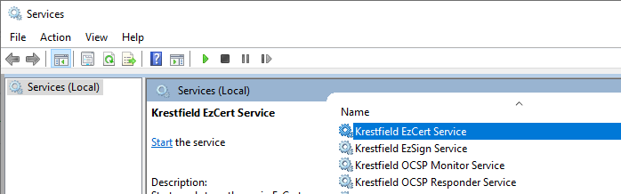
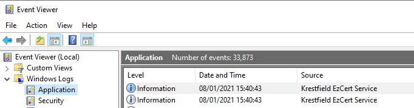

# Certdog Installation Troubleshooting


If you hit issues during the installation they can usually be resolved quite easily. You won't normally have to re-download the database or java files to resolve


### Unable to start database

If the installation outputs that it was unable to start the database and checking the ``installlog.out`` file shows it has trouble connecting, this is most likely because the Visual C++ Redistributable package is missing

Install **VC_redist.x64.exe** which is contained within the ``.\install`` directory. A check is made by the installer to determine if this is present but there may be mismatched versions on the system


If you still see issues starting the database, perform the following:

Open a PowerShell window as Administrator, navigate to ``.\certdog\install`` and run ``reset-db.ps1``  

Type **y** to confirm

Run the ``install-db.ps1`` script and enter the details as before (note: passwords and account details do not need to be the same as they would have been removed as part of the reset above)

When complete, open the services snapin and start the **Krestfield Certdog Service**


### Unable to start service

During install, when attempting to start the certdog services, if you see the following:

```powershell
Starting the service...
Unable to start the service
```

Open the Event Log and view **Windows Logs > Application**. If you see any entries with the ``Source = .NET Runtime``, click on them and if you see something like the following:

```powershell
.NET Runtime version : 4.0.30319.0 - This application could not be started.This application requires one of the following versions of the .NET Framework:
 .NETFramework,Version=v4.8
```

This indicates you do not have .NET version 4.8 installed which the services require. Install .NET version 4.8  

If the installation seemed to complete OK except for this, there is no need to repeat the installation but once the .NET 4.8 Runtime has been installed you must configure the services manually, as follows:

1. Open a new PowerShell window as Administrator and navigate to the ``.\certdog\install`` directory
2. Run: ``start-certdog-service.ps1`` and enter the master password when prompted
3. Run ``configure-adcs-service.ps1``

Then locate and start the following services in the services snapin (if not running):

* Krestfield Certdog Service

* Krestfield Adcs Driver (if installed)


### Other Failures

If any of the scripts failed to execute fully, the configuration may not be complete. In these cases it is often easier to delete the ``certdog`` directory (where the files were unzipped) and attempt the installation again, checking that the account being used has Administrator level permissions on the system  

Alternatively, you may try the following to attempt to start services manually and determine the cause of the issue:

Open the Windows Services snapin and search for the **Krestfield Certdog Service**:



Attempt to restart this service and monitor to ensure it starts OK (press F5 to refresh the view). Note, it can take several seconds for the service to start-up 

Open the **Windows Event Viewer** and navigate to **Windows Logs  > Application**




Search for entries with Source = **Krestfield Certdog Service**

Check if there are any error entries that may indicate issues starting the system


If the service is still not operating, open a PowerShell script as an Administrator and navigate to the installation directory e.g.  

``C:\Program Files\Krestfield\certdog``

Navigate to the **bin** directory and type, ``.\start-db.ps1``

You should see:

```powershell
Starting database...
DB Running OK
```

Then type ``.\start-tomcat.ps1``

You should see:

```powershell
Starting tomcat using:
Java: C:\temp\hash\java\jdk15\bin\java.exe

Retrieved master password from the cmmasterpassword environment variable OK

JRE_HOME=C:\temp\hash\java\jdk15
Starting C:\temp\certdog\tomcat\bin\catalina.bat please wait...

Testing https://127.0.0.1/certdog/api...
Application is running
```


But if there is an issue, you will see something like:

```powershell
Testing https://127.0.0.1/certdog/api...
Unable to connect to the remote server
Not started yet...waiting...

Application failed to start. Check console.out and console.err for errors
```

Analyse the ``console.err`` and ``console.out`` files for any obvious errors. 