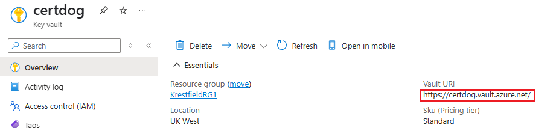
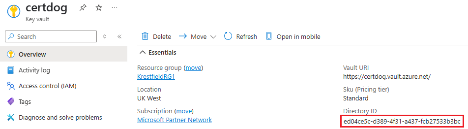
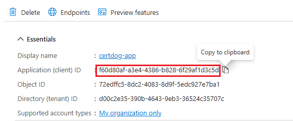
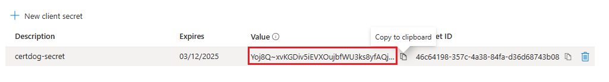
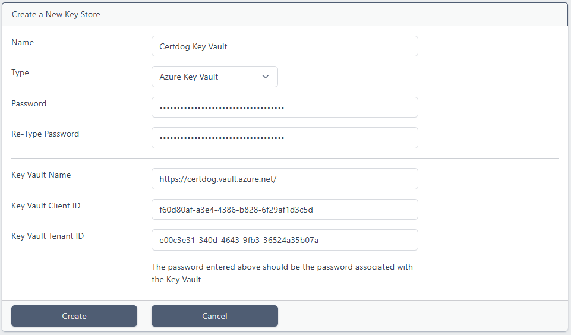
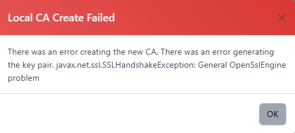

# Key Stores


A Local CA makes use of a Key Store. This is where the CA keys will be generated and stored  

A key store must be available before a Local CA can be created - as it relies on this for the key generation  

Key Stores can be one of the following types:

* [Software](#software)

  * The CA keys will be secured using software based encryption and stored in the database  
* [PKCS#11](#pkcs#11)
  * An HSM (Hardware Security Module) that supports the PKCS#11 interface may be used to generate and store the CA keys. Any HSM that supports the PKCS#11 interface may be used, but the following are specifically supported:
    * Thales Luna and DPoD (Data Protection on Demand)
    * nCipher
    * Utimaco
    * AWS Cloud HSM
* [Google KMS](#google-kms)
  * A key ring in Google Cloud may be used for key storage. Again, Certdog enforces HSM protection for these keys

* [Azure Key Vault](#azure-key-vault)
  * A Key Vault in Azure can be used. Note: Certdog enforces HSM protection for keys and this is only supported on the Key Vaults created in the *Premium* pricing tier (Certdog will not operate with *Standard* tier Key Vaults)


<br>

## Obtaining Credentials and Settings

Before you create a Key Store, the required credentials must be obtained. These are dependant on what type of key store is being used
<br><br>

### Software

Only a password is required for software key stores. This password is used to protect any keys generated by the CA. The password itself will also be encrypted before being stored
<br><br>

### PKCS#11  

The PKCS#11 interface makes use of a local library which interfaces to the HSM  

This library is provided by the HSM vendor and the setup of this (and any other required configuration) is vendor specific  

Note that this setup must be performed on the Certdog server itself - not on the client accessing the Certdog server

Once setup, the following pieces of information are required:

* **The PKCS#11 Library**

  This is the library providing the PKCS#11 interface. The full path is required. A typical example for an nCipher HSM's library is:

  Windows: ``C:\Program Files (x86)\nCipher\nfast\toolkits\pkcs11\cknfast-64.dll``

  Linux/Unix: ``/opt/nfast/toolkits/pkcs11/64/libcknfast.so``

* **Slot**

  A PKCS#11 device can host many slots which may refer to partitions (on Luna HSMs) or cardsets (on nCipher HSMs). Each slot may use a different password. This will all be configured during the HSM setup so you just need to be sure your password matches with the slot you will reference

* **Password**

  This is the password used to authenticate to the HSM. It may be an operator cardset passphrase (in the case of nCipher) or a partition passphrase (in the case of Thales Luna) or a combination of username and password as required by the AWS Cloud HSM (which requires the password in this format: ``username:password``)

* **Use Module Protection**

  Some HSMs allow access without requiring a password. Access to the HSM should then be secured using other mechanisms (e.g. network layer security)
<br><br>

### Google KMS  

To use a key ring in Google Cloud, the following are required. These can be obtained/configured from your Google Cloud account:

* **Project**

  This is the project ID as displayed in the Home dashboard:


**NOTE**: When entering the project name into the EzSign properties, even if the project name is case sensitive, the name must always be entered in lower-case in the properties file. This is a Google API requirement. E.g. if the project name in Google appears as **PkCloud**, the value entered in the properties file must be **pkcloud**

* **Key Ring Location**

  You must have created a key ring from the **Security** &#8594; **Key management** section in *Google Cloud*

  When the key ring has been created the location will be displayed (e.g. *us-west4*, *europe-west2* etc.)

  Note that it is recommended that a dedicated key ring be assigned to Certdog as it will be creating and deleting keys within this key ring


* **Key Ring Name**

  The name you assigned to the key ring e.g. *certdog*

* **Key Ring Credentials**

  This is the JSON credential string associated with a service account that has permissions to access the key ring

  A service account can be created from the **IAM & Admin** &#8594; **Service Accounts** section in the *Google Cloud Console*. It is recommended that a dedicated service account is created for Certdog

  The account must have the following roles:

  * Cloud KMS Admin
  * Cloud KMS CryptoKey Signer
  * Cloud KMS CryptoKey Public Key Viewer

  To obtain the JSON credential, select the **Keys** section for the service account and select **Add Key**, choosing **JSON** as the *Key type*. Download the produced JSON file - it is the contents of this file that must be pasted into the **Key Ring Credentials** section
<br><br>

### Azure Key Vault  

Note that only the premium tier of Key Vaults can be used with Certdog as HSM backed storage is enforced. When creating a Key Vault, ensure that the *Pricing tier* selected is: **Premium (includes support for HSM backed keys)**

Also, ensure that the *Access configuration* is set to the **Vault access policy** permission mode. This is required to limit access to the vault from the *App registration* only, with access limited to only a few key and certificate operations.

<br>

To use a Key Vault in Azure, the following are required. These can be obtained/configured from the *Azure Portal*:

<br>

* **Key Vault Name**

  This is the **Vault URL** as displayed on the Key Vault's overview page, it is not the display name. I.e. in the example below the *Key Vault Name* required is: **https://certdog.vault.azure.net**



<br>

* **Key Vault Tenant ID**

  This is also referred to as the **Directory ID**. This value can be obtained from the Key Vault's overview page. See the highlighted item in the example below:



<br>

* **Key Vault Client ID**

  This is the ID of an *App registration*. Referred to as the **appId** or **Application (client) ID** (depending where it is displayed in Azure). See the steps below on how to create an *App registration* and obtain this value

<br>

* **Password**

  This is a secret associated with the *App registration*. Also referred to as the **client secret** (or **Value** of the client secret). See the steps below on how to create a *Secret* and obtain this value

<br>

To obtain these values, we need to register an application that will then be authorised to use the key vault:  

<u>Obtain **Key Vault Client ID** (Create App Registration)</u>

1. If not done so already, create a **Key Vault** in the *Azure Portal*
2. Once this has been created, from the *Portal*, navigate to **Microsoft Entra ID** and under **Manage**, select **App Registrations**, from the left hand menu 
3. From the top menu click **New registration** 
   1. Provide a **name** for the application (e.g. *certdog-app*)
   2. Select the *supported account types*
   3. For the *Redirect URI (optional)* setting, choose **Web** and provide a **URL**. The URL does not need to be a real URL but must be formatted as a URL. For example, it could be: https://certdog.myorg.com 
   4. Click **Register**
4. Copy the **Application (client) ID**. This is the value required for **Key Vault Client ID**



<br>

Next we need to create a client secret. Certdog will use this to authenticate to Key Vault:

<u>Obtain **Password** (Create Client Secret)</u> 

1. Still in *App Registrations*, on the **All Applications** tab. Click on the **newly created application**. Click **Refresh** if this is not seem immediately
2. From the left hand menu, under **Manage**, click **Certificates & secrets**.
3. Click **New client secret**
4. Give the secret a *description* and *expiry date* and click **Add**
5. Copy the **Value**. Ensure you do this now and do not leave the page. This is the only time it will be visible



**Note**: This value is sensitive as it will grant access to the Key Vault. Ensure it is sufficiently protected.

<br>

Lastly we need to grant access from this application to the Key Vault

<u>Grant Access to Key Vault</u>

1. Under *Key Vaults*, click on the **Key Vault**
2. Click on **Access policies** and click **Create**
3. Select the following permissions:
   1. Key Management: **Get**, **List**, **Create**
   2. Cryptographic Operations: **Sign**
   3. Certificate permissions: **Get**

4. Click **Next**
5. Locate and select the **application** (created above e.g. certdog-app) and click **Next** then **Next** again
6. Click **Create**

<br>

These details will be entered into the Key Store configuration as follows:



However, see the [Creating a Key Store](#creating-a-key-store) section below.

<br>

#### Trouble Shooting

When using a Key Vault, if you see this error



This is likely to be due to Microsoft Key Vault using a TLS CA certificate that is not trusted by Certdog.

To rectify, perform the following steps:

1. Obtain the Azure Root Certificate

   Navigate to the Key Vault URL from a browser and download the Root CA certificate (e.g. AzureRoot.crt)

2. Open a command prompt as Administrator and run the following command (altering to your own certdog installation location):

```cmd
> keytool -import -trustcacerts -alias azureroot -file "AzureRoot.crt" -keystore "c:\certdog\config\sslcerts\dbssltrust.jks"
```

Enter the key store password of ``temp1234!`` and choose "yes" to accept the certificate.

<br>

#### Configuring via Command Line

This can also be configured from the command line.

1. Next, open **Azure Cloud Shell** (this example is using a bash shell) either by clicking the shell icon from the *Portal*:

    

    or by navigating to https://shell.azure.com/

    <br>

2. At the prompt type the following to create a service principal called certdog (though you can name this whatever you want):

    ```shell
    az ad sp create-for-rbac -n certdog --skip-assignment
    ```
    E.g.  
    ```shell
    az ad sp create-for-rbac -n certdog --skip-assignment
    The output includes credentials that you must protect. Be sure that you do not include these credentials in your code or check the credentials intoyour source control. For more information, see https://aka.ms/azadsp-cli
    'name' property in the output is deprecated and will be removed in the future. Use 'appId' instead. 
    {
        "appId": "fd94f971-ebd9-4a32-a56e-97427655429e", 
        "displayName": "certdog",
        "name" : "fd94f971-ebd9-4a32-a56e-97427655429e",
        "password": "nScc7-6T.gOI7.ugHawFRRoUbwUA_agrC-",
        "tenant": "36524c35-390b-4343-390b-36524c35707c"
    }
    ```

    <br>

3. Note the following items: 
   * **appId**

     This is your **Key Vault Client ID**

   * **password**

     This is the required **password** 

   * **tenant**

     This should be the same value as displayed for *Directory ID* on the key vaults overview page and is the **Key Vault Tenant ID**

     <br>

4. We must now set the permissions on the key vault for this application. To do this, type the following at the shell:

    ```shell
    export AZURE_CLIENT_ID=[value for appId returned above] 
    export AZURE_CLIENT_SECRET=[value returned for password above]
    export AZURE_TENANT_ID=[value returned for tenant above]
    
    az keyvault set-policy --name [Key Vault Name] --spn $AZURE_CLIENT_ID --key-permissions delete get list create sign verify encrypt decrypt wrapKey unwrapKey –-certificate-permissions get list
    ```

The [Key Vault Name] in this instance is not the full URI, but just the *name*. For example, if you had created a key vault called **certdog**. Its URI would be: https://certdog.vault.azure.net/ but the name required here would just be: **certdog**

For example:

```shell
export AZURE_CLIENT_ID="fd94f971-ebd9-4a32-a56e-97427655429e"
export AZURE_CLIENT_SECRET="nScc7-6T.gOI7.ugHawFRRoUbwUA_agrC-"
export AZURE_TENANT_ID="36524c35-390b-4343-390b-36524c35707c"

az keyvault set-policy --name certdog --spn $AZURE_CLIENT_ID --key-permissions get list create sign --certificate-permissions get
```


You would now have created an account that can be configured in Certdog to access your key vault. 

<br>

## Creating a Key Store


1. From the certdog application, login as an **Administrator**
2. From the menu select, **Local CA** &#8594; **Key Stores**
3. Click **Add New Key Store**
4. Enter a **Name** for the Key Store. This can be anything you like and is used to reference it later  
5. Select the **Key Store Type** from the drop down
<br><br>
### Software


Enter a **password**, retype and click **Create**  

Note that this password will be used to protect any keys created by Local CAs that use this key store. Ensure it meets your password security requirements  
<br><br>
### PKCS#11


Enter the **Password**, **PKCS#11 Library**, **HSM Model** and choose the **Slot** as per the details outlined above and click **Create**
<br><br>
### Google KMS


Enter the **Project**, **Key Ring Location**, **Key Ring Name** as obtained above. For the **Key Ring Credentials**, open the JSON file that was downloaded and copy its contents into the box. Click **Create**
<br><br>

### Azure Key Vault


Enter the **Password**, **Key Vault Name**, **Key Vault Client ID** and **Key Vault Tenant ID** as obtained from above. Click **Create**
