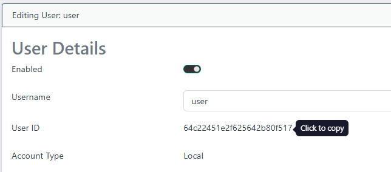
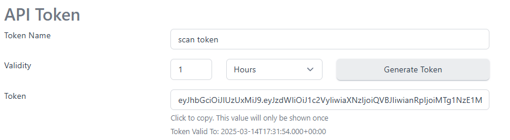

# Running a Microsoft Cert Store Scan

  <br>

Certificates can be discovered and imported into the certdog inventory from Microsoft Machine Certificate Stores. This enables searching and expiry monitoring of those certificates. This can also assist with locating unknown or unexpected certificates (including self-signed instances).

The scan operates via a PowerShell script that can be run within your own infrastructure. The script requires no special privileges to run and it will perform the scan and upload discovered certificates to certdog. 

<br>

You may run this script from multiple machines and multiple times. Certificates already imported into certdog will not be re-imported.

<br>

## Overview of Operation

The PowerShell script uses the WinRM protocol to run a remote command on each of the selected servers to extract all certificates in the local machine store.  

The servers to be scanned can be provided as a list, or the script can pull out all servers registered in Active Directory. A subset of servers from Active Directory can be scanned by providing a DN/OU where the required servers are located. If servers are not domain joined then the list must be provided. 

The script then makes a rest API call on the certdog server, to import each of the discovered certificates. The certificates are associated with a certdog user and team. Additional information can be stored with the imported certificates.

<br>

## Pre-Requisites

* A server in your environment that has access to the end points you wish to scan
  * This is where you will run the script from

* The server must be able to communicate with servers being scanned over the WinRM ports (5985 or 5986 if using SSL)
* The server must have access to the certdog server over port 443
* The ability to download and run the PowerShell script

<br>

The script will require the following information:

- The **certdog server name (or IP address)**

  e.g. ``certdog.internalserver.local`` or ``192.168.55.142`` etc.

- An **API key** for the script to be able to authenticate to certdog

- The **IDs of the user and team** we want the imported certificates to be associated with

- Optionally:

  - A credential (**username** and **password**) of an account that has permissions to extract certificates on the remote servers being scanned. This is usually an account with Administrator permissions. Alternatively the account running the script will be used
  - A list of **server names** to scan
  - The details of the **OU in Active Directory** to scan
    - If neither the server names or the OU are provided, the script will scan all machines registered in Active Directory


We will see how to obtain these values in the next section.

<br>

<br>

## Quick Start

Download the script from [here](https://krestfield.s3.eu-west-2.amazonaws.com/certdog/scripts/ms-keystore-scan.ps1)

Save the script to the server and populate the ``settings.json`` file as follows:

```json
{
	"certdogServer" : "certdog-environment.uksouth.cloudapp.azure.com",
	"userId" : "67cad5115ebaae0121024963",
	"teamId" : "67cad4f45ebaae0121024961",
	"extraInfo" : "From a scan of Microsoft KeyStores.",
	"ignoreSslErrors" : true,
    "scanTheseServers" : [],
    "scanThisOU" : "",
	"useSsl" : false
}
```

Entering your own values (see below for how to obtain this information)

Set the credentials:

```powershell
.\ms-keystore-scan.ps1 -setCredentials
```

Entering the certdog API key and the username and password of the account that will be used to access the remote servers.

Run the script:

```powershell
.\ms-keystore-scan.ps1
```

<br>

Continue reading for detailed information on setting up these details.

<br>

<br>

## Certdog Setup

Decide what user and team you wish the certificates to be associated with. 

Either choose an existing user or create a new user for this specific purpose. For example. you may create a Team that has no permissions on any Certificate Issuers and a new user that is a member of this team. This will give this *certificate import* user very limited privileges - only permitted to import certificates and then view these certificates.  

To setup a dedicated user and team, follow Appendix A below.   

<br>

#### Obtain the User and Team ID

From certdog, as an Administrator, navigate to **Users** under the *ADMINISTRATION* section. Select the chosen user and click **View/Edit**. 

The user ID is displayed. You can click to copy this value.




For older versions (1.11 and earlier) the URL in the browser will contain the ID. This is the number at the end of the URL. 

E.g. When viewing a user's details, the URL may display something like this:

```
https://certdog.net/certdog/ui/#/administration/edituser/673de9bcfac0d02ac6ced94d
```

In this case the user ID is: ``673de9bcfac0d02ac6ced94d``

Note this ID.

Do the same for the Team you wish the certificates to be associated with. Note: The user must be a member of the team selected.

You can also use the PowerShell module to obtain the user and team IDs. See [Appendix C]()

<br>

<br>

#### Obtain an API Token

As an Administrator navigate to **Users** under the *ADMINISTRATION* section. Select the chosen user and click **View/Edit**. 

In the *API Token* section, select the time you wish this API key to remain valid for. If you are running a one-time scan, you can keep this value short (e.g. 1 Hour). If running multiple (as part of a scheduled task) select a longer value.

Click **Generate Token** and click on the *Token* to copy it.

Retain the value as it will be required by the PowerShell script.



<br>

<br>

#### Certdog Server Name

This is simply the hostname or IP Address where the certdog server resides. E.g. ``certdog.krestfield.local`` or ``192.168.55.42`` 

<br>

<br>

## Running the Script

#### Set Credentials

The script authenticates to the remote servers in order to run a command that will extract the certificates from the key store.  

The account used will be the same one that is running the script.  

However, the script can also securely store another account's credentials and use these account details to authenticate to the remote servers. 

This can be done by running this command:
```powershell
.\get-remote-certs.ps1 -setCredentials
```

This will also ask for the CertDog API Token and will also store this securely. 

This means no credentials need be passed to the script the next time it is run.

E.g.

```powershell
PS C:\Scripts> .\get-remote-certs.ps1 -setCredentials

Certdog KeyStore Scanner
------------------------


The following items will be encrypted under the current users account.

If this script will be run under another account, use the RunAs option to start this script under that account, then run with the SetCredentials option.

Enter the API Key that is used to authenticate to Certdog
API Key: *******************************************************************************************************************************************************************************************************************************

Enter the username for the account that will be used to access the servers being scanned
Username: krestfield\svc_scanner

Enter the password for the account that will be used to access the servers being scanned
Password: **********

Details stored. The script will use these credentials when it is next run.
```

Note that credentials are secured under the same account running the ``-setCredentials`` command. Therefore only that account can access the credentials. I.e. the same account must be used to set the credentials as running the command in the future.  


#### Script Parameters

The script requires the following parameters

- certdogServer
  - The name of the certdog server where the certificates will be imported. E.g. ``certdogsvr.orgname.local``

- userId
  - The ID of the user that the imported certificates will be associated with

- teamId
  - The ID of the team that the imported certificates will be associated with

- extraInfo
  - Information provided here will be stored with the discovered certificate

- ignoreSslErrors
  - Switch. If the server running the script does not trust the TLS certificate protecting the certdog API, include this switch e.g. ``-ignoreSslErrors``

- scanTheseServers

  - By default the script will attempt to scan all servers in the domain. This parameter can be provided to specify a server list explicitly. The script will then attempt to scan only those servers in this list. 
    E.g. ``-scanTheseServers @("server1.krestfield.local", "server2.krestfield.local")``

- scanThisOU

  - By default the script will attempt to scan all servers in the domain. This parameter can be used to filter the OU to search for machines in. 

    E.g. ``-scanThisOU "OU=VACluster,OU=Machines,OU=PKI,DC=krestfield,DC=local"``

- useSsl

  - Switch. If this switch is set, the WinRM protocol will connect over TLS (default port 5986)

- getServerList

  * Switch. Returns the list of servers it will scan if the script is run. No scanning will be performed. This takes into account the info provided by the parameters: scanThisOU and scanTheseServers

- certdogApiToken

  - If credentials are not stored locally (as described in the previous section) the API key must be provided via this parameter (or extracted from settings.json - see below)


#### settings.json

You may provide the settings mentioned above by creating a ``settings.json`` file.  

To do this, create a file as follows and save as ``settings.json`` at the same location as the script:

```json
{
	"certdogServer" : "certdog-environment.uksouth.cloudapp.azure.com",
	"userId" : "67cad5115ebaae0121024963",
	"teamId" : "67cad4f45ebaae0121024961",
	"extraInfo" : "From a scan of Microsoft KeyStores.",
	"ignoreSslErrors" : true,
    "scanTheseServers" : [],
    "scanThisOU" : "",
	"useSsl" : false,
    "certdogApiToken" : "eyJhbGciOi...LPpJa4VauCWwwWLCcfg"
}
```


The script can then be run without any need to pass these parameters. However, if any parameters are provided they take precedence over any provided in the ``settings.json`` file.

Note: That ``certdogApiToken`` is the credential that allows access to the CertDog API. If you have used the ``-setCredentials`` option then this does not need to be provided here (nor as a parameter) and it will be securely stored, locally. If present in this file (or provided as a parameter) ensure access to it is restricted. 


### Examples

Once you have set the credentials you can run the script. If you have created a ``settings.json`` file the script can simply be run by using the following command:

```powershell
.\get-remote-certs.ps1
```

But any parameters can be overridden. E.g. to alter only the extraInfo data:

```powershell
.\get-remote-certs.ps1 -extraInfo "Second scan of Microsoft Keystores"
```

  

If no settings.json file has been configured, then at a minimum the ``certdogServer``, ``userId`` and ``teamId`` parameters are required. E.g.:

```powershell
.\get-remote-certs.ps1 -certdogServer "certdog-environment.uksouth.cloudapp.azure.com" -userId "67cad5115ebaae0121024963" -teamId "67cad4f45ebaae0121024961"
```

In this example, all servers that can be retrieved from Active Directory will be scanned.


To scan a specific set of servers, provide the ``scanTestServers`` parameter. E.g.

```powershell
.\get-remote-certs.ps1 -scanTheseServers @("s1.k.local", "s2.kd.local", "s10.k.local")
```


To ignore SSL errors 

```powershell
.\get-remote-certs.ps1 -ignoreSslErrors
```


To view the servers that would be scanned

```powershell
.\get-remote-certs.ps1 -getServerList
```

```powershell
.\get-remote-certs.ps1 -scanThisOU "OU=VACluster,OU=Machines,OU=PKI,DC=krestfield,DC=local" -getServerList
```


Passing parameters:

```powershell
.\get-remote-certs.ps1 
	-certdogServer "certdog-environment.uksouth.cloudapp.azure.com" 
	-userId "67cad5115ebaae0121024963" 
	-teamId "67cad4f45ebaae0121024961" 
	-extraInfo "Scan of servers in Test OU" 
	-scanThisOU "OU=Test,OU=Machines,OU=PKI,DC=krestfield,DC=local"
	-ignoreSslErrors
	-useTls
```

<br>

## Logging

All logs are output to the ``.\logs`` folder that is created at the same location as the script.  

There are two files created each time the script is run:

* [TIMESTAMP]-log.txt

* [TIMESTAMP]-failed-servers.txt

E.g.

* 20250625-123314-log.txt
* 20250625-123314-failed-servers.txt

The log.txt file contains errors and event information from the run. The failed-servers.txt file contains a list of all servers that could not be contacted and hence, no certificates could be extracted. These servers may be offline or there may be network connectivity issues. The script could be re-run against these specific servers if required.

<br>

<br>

### Appendix A: Creating a dedicated User and Team

See here: [https://krestfield.github.io/docs/certdog/teams.html](https://krestfield.github.io/docs/certdog/teams.html) for details on how to add a new team.  

Do not set the team to be an Administrator and there is no need to specify any Certificate Issuers. The Team will not need any specific permissions.

See here: [https://krestfield.github.io/docs/certdog/users.html](https://krestfield.github.io/docs/certdog/users.html) for details on how to add a new user. Add this user to the team created above. 

<br>

<br>

### Appendix B: Installing PowerShell on Non-Microsoft Operating Systems

Instructions on how to install PowerShell on other operating systems can be found here:

https://learn.microsoft.com/en-us/powershell/scripting/install/installing-powershell?view=powershell-7.4

<br>

<br>

### Appendix C: User and Team IDs

The user and team IDs can be obtained via the PowerShell module.

Open a PowerShell window as Administrator and navigate to where the certdog-module.psm1 file is located. If on the certdog server this will be ``[certdog install location]\bin`` e.g. ``c:\certdog\bin``  

Run the following commands to locate the user and team IDs:

```powershell
PS C:\certdog\bin> Import-Module .\certdog-module.psm1
PS C:\certdog\bin> login
Username: admin
Password: ********
Attempting login at: https://127.0.0.1/certdog/api
Authenticated OK
PS C:\certdog\bin> get-user -username cert-import

id                     : 673de9bcfac0d02ac6ced94d
email                  : cert-import@krestfield.com
username               : cert-import
group                  : USER
enabled                : True
teamsIds               : {673de985fac0d02ac6ced94b}
numFailedLoginAttempts : 0
userMessage            :
nextAllowedLogonTime   : 0
accountType            : 0
accountTypeStr         : Local
lastLoginTime          : 2024-11-21T11:22:57.888+00:00
lastLoginIpAddress     : 127.0.0.1
mustChangePassword     : False

PS C:\certdog\bin> get-team -name Cert-Import-Team

id                     : 673de985fac0d02ac6ced94b
name                   : Cert-Import-Team
description            :
internalGroup          : USER
adGroups               : {}
authorisedCas          : {}
adminUsernames         : {}
dontSendEmailsOnIssue  : True
dontSendReminderEmails : False
ipWhiteList            :
```

The IDs are displayed.

