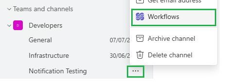
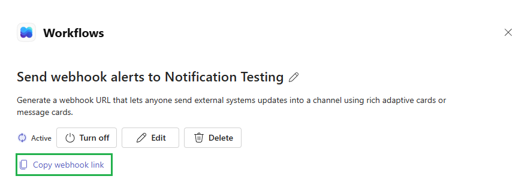
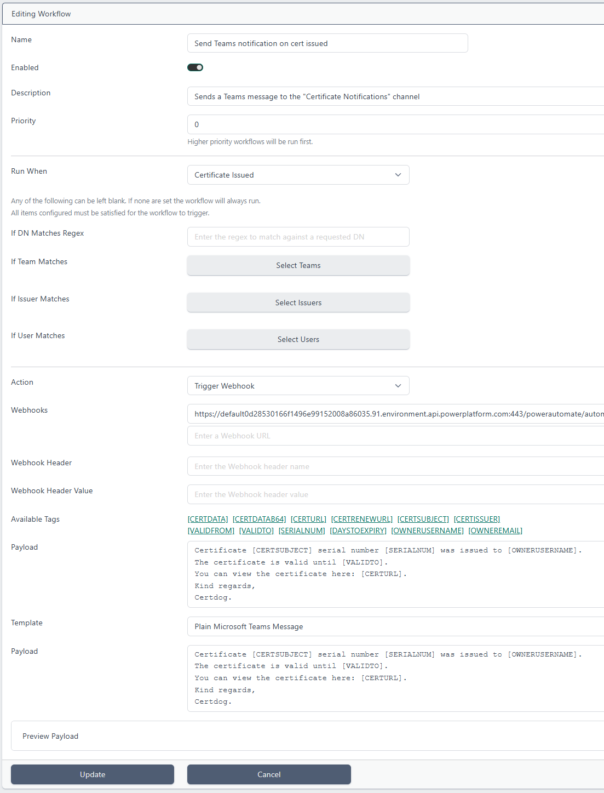
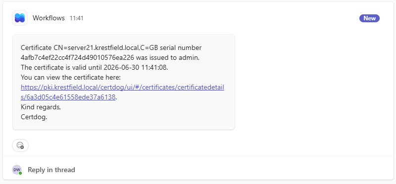
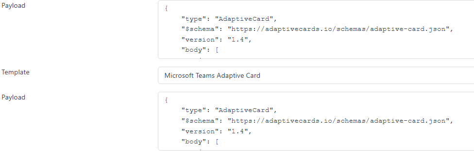
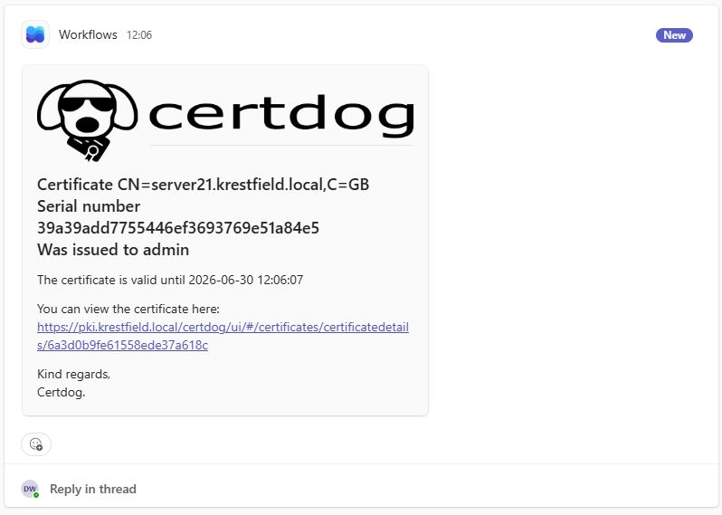
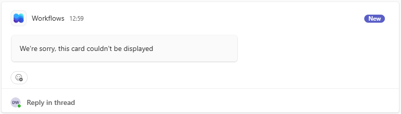

# Sending MS Teams Notifications

> From Version: 1.17.0

<br>

Certdog can be configured to send notifications to a Teams channel using [Microsoft Teams Workflows](https://support.microsoft.com/en-us/office/overview-of-workflows-in-microsoft-teams-4998095c-8b72-4b0e-984c-f2ad39e6ba9a) using Certdog's own Workflows

The following describes how to configure Certdog to send a Microsoft Teams message when a certificate is issued but the same steps will work for other events (e.g. certificate expiring)

<br>

### Step 1: Create the webhook in Teams

From **Teams**, select the ellipses (**...**) next to your *Teams Channel* and choose **Workflows**:



From the *Workflows* window, under *Start from a template*, scroll along until you find the workflow **Send webhook alerts to a channel**:


Click on this Workflow

In the next screen confirm the *Team* and *Channel*. Update if required:


Click **Save**



The webhook will be created. Click the **Copy webhook link** and save to a text file as we'll need it in the following steps

<br>

## 2. Create a Certdog Workflow

In Certdog, click **Workflows** in the menu on the left, and then click **Add New Workflow**:



Enter a **Name** and **Description** (optional)

For *Run When*, select **Certificate Issued** 

For *Action*, select **Trigger Webhook**  

For *Webhooks*, paste in the **webhook link** saved from the step above

For *Template*, select **Plain Microsoft Teams Message**

For *Payload*, enter some text, using the *Available Tags* as required e.g.

```
Certificate [CERTSUBJECT], serial number [SERIALNUM] was issued to [OWNERUSERNAME]. 
The certificate is valid until [VALIDTO]. 
You can view the certificate here: [CERTURL].
Kind regards,
Certdog.
```

You can view the resultant payload by clicking the **Preview Payload** button. This is the payload that will be sent to teams and is formatted based on the Template selected

When a certificate is issued, a Teams message will then be sent e.g.



<br>

For more control, for *Template*, **None** can be selected. In this case a raw message must be entered, formatted as per the [Microsoft Connector Documentation](https://learn.microsoft.com/en-us/connectors/teams/?tabs=text1%2Cdotnet#microsoft-teams-webhook)  

An example using this option, that will result in the same Teams message being sent is given below:

```json
{
  "type": "message",
  "attachments": [{
    "contentType": "application/vnd.microsoft.card.adaptive",
    "content": {
      "type": "AdaptiveCard",
      "$schema": "http://adaptivecards.io/schemas/adaptive-card.json",
      "version": "1.0",
      "body": [{
        "type": "TextBlock",
        "wrap": true,
        "text": "Certificate [CERTSUBJECT], serial number [SERIALNUM] was issued to [OWNERUSERNAME]. 
The certificate is valid until [VALIDTO]. 
You can view the certificate here: [CERTURL].
Kind regards,
Certdog."
      }]
    }
  }]
}
```

<br>

You can also include more advanced formatting options using Microsoft Adaptive Cards. See [Adaptive Cards Documentation](https://adaptivecards.microsoft.com/) for full details. Microsoft provides a [Designer](https://adaptivecards.microsoft.com/designer.html), that can be used to create more elaborate cards.

Note that when using the designer, it will generate Adaptive Cards with version 1.6 or greater. Teams only supports up to version 1.4, so this part will have to be edited.

Using the designer, images, media and formatted text can easily be added. As an example, the designer produced the following output:

```json
{
    "type": "AdaptiveCard",
    "$schema": "https://adaptivecards.io/schemas/adaptive-card.json",
    "version": "1.6",
    "body": [
        {
            "type": "Image",
            "url": "https://certdog.net/certdog/ui/certdogtitle.png"
        },
        {
            "type": "TextBlock",
            "wrap": true,
            "text": "Certificate [CERTSUBJECT]\nSerial number [SERIALNUM] \nWas issued to [OWNERUSERNAME]",
            "style": "heading"
        },
        {
            "type": "TextBlock",
            "text": "The certificate is valid until [VALIDTO]",
            "wrap": true
        },
        {
            "type": "TextBlock",
            "text": "You can view the certificate here: [CERTURL]",
            "wrap": true
        },
        {
            "type": "TextBlock",
            "text": "Kind regards,\nCertdog.",
            "wrap": true
        }
    ]
}
```

Note that the version is 1.6. This must be changed to **1.4**. Then this data is copied into the **Payload** and the *Template* changed to **Microsoft Teams Adaptive Card**:



On execution this will produce a Teams post as follows:



<br>

## 3. Test Your Workflow

To test your workflow, simply carry out the action matching the workflow's trigger (such as issuing a certificate)

You should see a message in the Teams channel

If this fails, check the logs for entries such as:

```
Failed to trigger Webhook at https://default0d23530166f1496e99152008a86035.91.environment.api.powerplatform.com:443/powerautomate/automations/direct/workflows/ac6682e7f0c0417184dda54425b15fb5/triggers/manual/paths/invoke?api-version=1&sp=/triggers/manual/run&sv=1.0&sig=0r9kNtd_TTdwe3oYhvHm9pGyZk79yT3qhdxu3Lyai1w: 400 Bad Request: "{"error":{"code":"InvalidRequestContent","message":"The request content is not valid and could not be deserialized: 'Unexpected character encountered while parsing value: C. Path '', line 0, position 0.'.","messageTemplate":"InvalidRequestContent"}}"
```

In this example, it indicates a formatting error. A possible cause of this is selecting a *Template* of *None* but not formatting the *Payload* correctly

Note, if using Adaptive cards and the version is not changed to 1.4. No error will be produced. In Teams you will see:



Due to Teams not understanding the version

