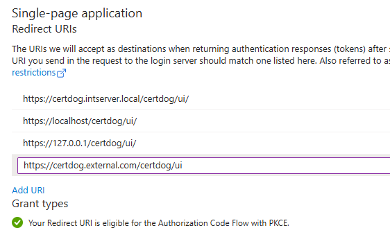
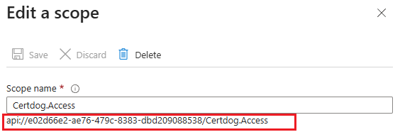
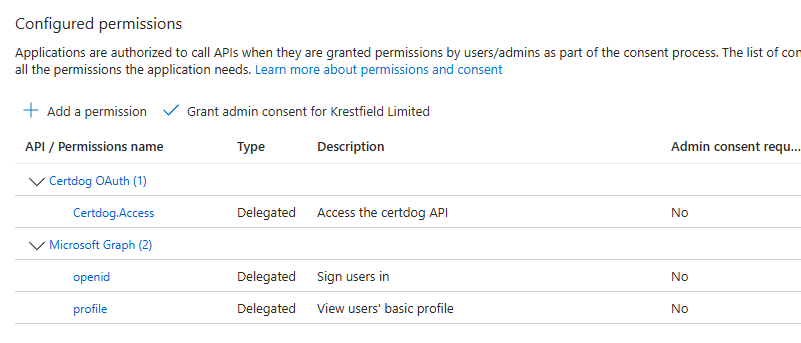
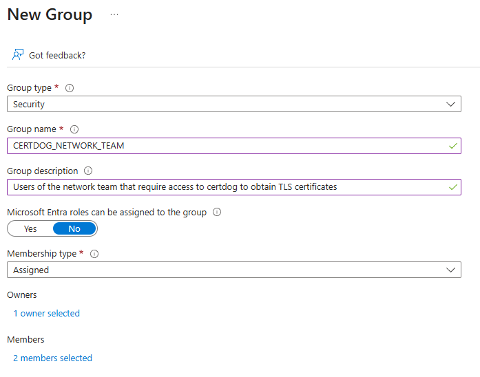
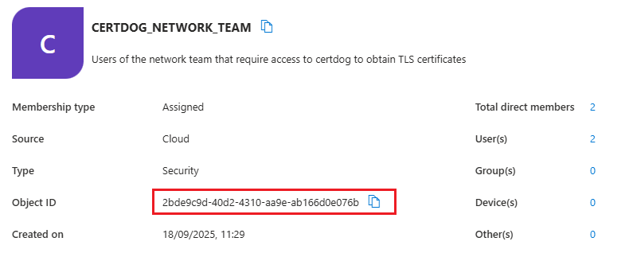
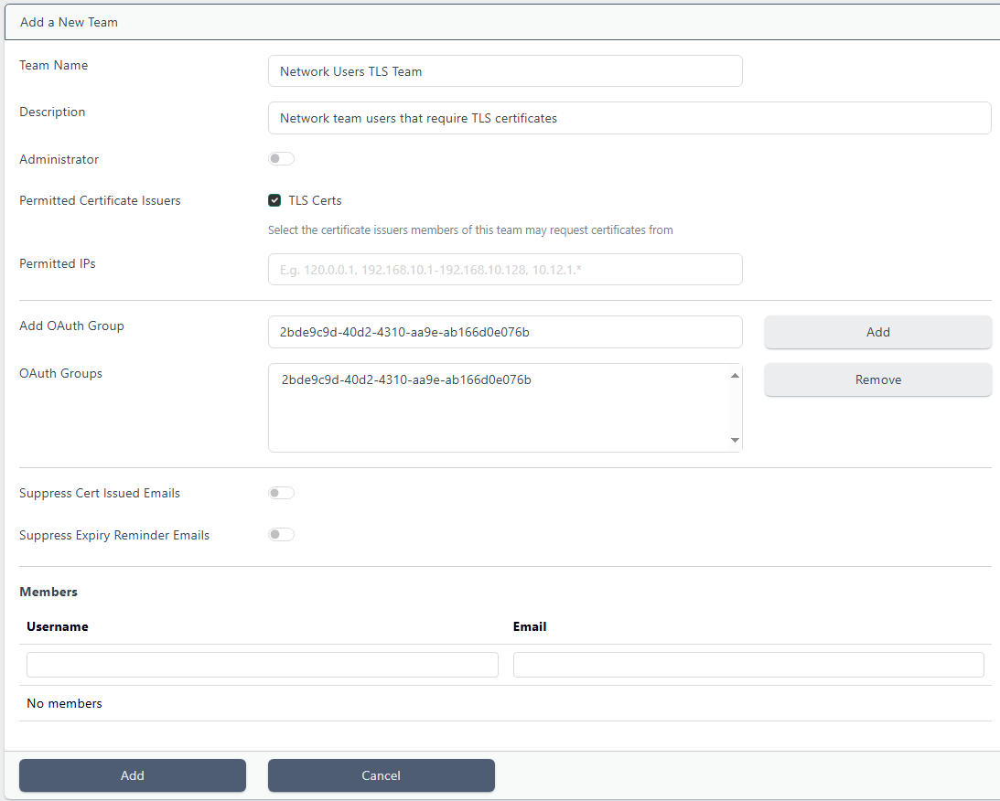
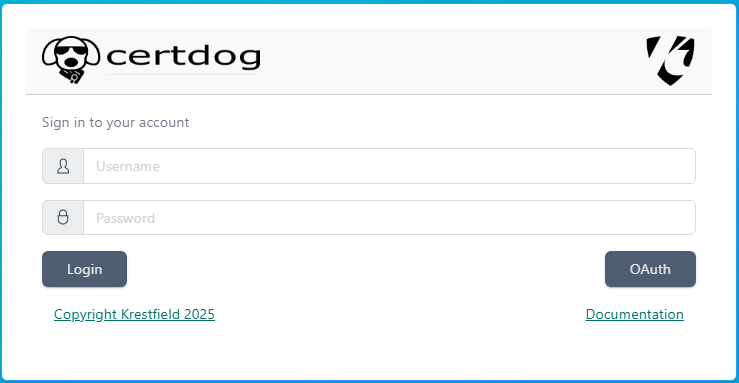
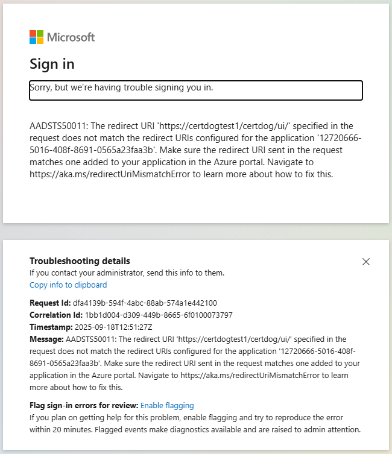
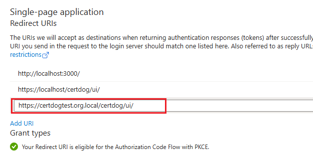

# OAuth 2.0 and OIDC Integration

Certdog supports authorization and authentication of users via OAuth 2.0 and OIDC services, including processing of group membership.

Currently, the following provider(s) are supported:
- Microsoft Entra ID (formerly Azure AD)

<br>

Enabling OAuth support does not disable the use of local or Active Directory accounts. I.e. all three authentication options can be enabled at the same time.

Details on how to enable this with Entra ID are given below. The steps are detailed but still, some familiarity with Entra ID is needed. If in any doubt, contact [Krestfield Support](mailto:support@krestfield.com) who can assist with the setup process.

<br>

## Before Starting

Access to Azure Entra ID is required, with permissions to create an App Registration. If another team manages that configuration, they can follow the [Create an App Registration in Microsoft Entra ID](#create-an-app-registration-in-microsoft-entra-id) instructions below and provide the required values (e.g. [REDIRECT-URI]) for importing into certdog.

<br>

Ensure that the correct URL has been configured for certdog (as described [here](post-Installation.html)) and ideally the final TLS certificates have been installed (as described [here](installation.html#4-ssl-configuration)).

This is required as we will need to configure redirect URLs within Entra ID. These should be the final URLs that all users will access the system from. 

When certdog is initially installed you may access at 127.0.0.1. But when completing the steps above you may configure a DNS entry to point to the certdog server. When you would access as something like https://certdog.domain.local. This would then be the URL to configure in the Entra ID settings below.

<br>

## Configuring OAuth

To enable OAuth and OIDC support you must:

1. [Create an App Registration in Microsoft Entra ID](#create-an-app-registration-in-microsoft-entra-id)

2. [Update the API properties file](#update-the-api-properties-file)

3. [Update the UI config file](#update-the-ui-config-file)

4. [Restart Certdog](#restart-certdog)

5. [Map Entra ID Groups to Certdog Teams](#map-entra-id-groups-to-certdog-teams)

These steps are detailed in the next sections.

<br>

## Create an App Registration in Microsoft Entra ID

From Azure, click on **Microsoft Entra ID** and navigate to **App registrations**

<br>

#### Create a New App Registration

Ensure you have the correct hostname for the certdog server. E.g. https://certdog.intserver.local as discussed in the [Before Starting](#before-starting) section above.

<br>

1. Click **+ New registration**

2. Enter a name for the application, e.g. "Certdog"

3. For *Supported account types* select **Accounts in this organizational directory only**

4. Under *Redirect URI (optional)*, choose **Single-page application SPA** from the *Select a platform* drop down and enter the **Cert User Interface URL** in the form:

​	``https://[certdog hostname]/certdog/ui/`` 

​	E.g. if your instance is located at https://certdog.intserver.local the full URL to enter would be: 

​	``https://certdog.intserver.local/certdog/ui/`` 

NOTE: This MUST be the URL you will be accessing the certdog server from. If it is wrong, redirection after authentication will fail. 

7. Note this value as it is the **[REDIRECT-URI]** and will be required later
8. Click **Register**

<br>

If you will be accessing certdog from multiple URLs - in addition to the one set in Step 4 above. From the newly created app registration click on **Authentication** (under the *Manage* section). In the Single-page application section, click the Add URL link and enter any other possible URLs. E.g.



Click **Save**

<br>

#### Expose the API

1. From the new app registration, navigate to **Owners** (under the *Manage* section) and add your own account as an owner if not already listed

8. From the new app registration, navigate to **Expose an API** and click the **Add** link to the right of *Application ID URI* and click Save accepting the default value for the Application ID URI

9. Click **+ Add a scope** and for 

   1. *Scope name* enter **Certdog.Access**

   2. For *who can consent* select **Admins and users**

   3. for *Admin consent display name* enter something like **Access the Certdog API**

   4. for *Admin consent description* enter something like **Allows the app to access and modify certdog API data**

10. Note the value beneath the *Scope name* text box:

    

    E.g. ``api://12720666-5016-408f-8691-0565a23faa3b/Certdog.Access`` which is made up of the Application ID URL and the Scope name

11. Note this value as it is the **[API-SCOPE]** and will be required later

12. Click **Add scope**

<br>

#### Add Permissions

1. Click **+ Add a permission**, select **My APIs** and select the name of the application (e.g. Certdog)

8. Under *Select permissions* select **Certdog.Access** and click **Add Permissions**

9. Click **+ Add a permission** again, select **Microsoft Graph**, then **Delegated permissions**

10. Search for and select **openid** and **profile** then click **Add permissions**

11. Click the **three dots** at the end of the *User.Read* permission under *Microsoft Graph* and select **Remove permission**, then **Yes, remove**

    The permissions should look like this:



<br>

#### Enable the claims for user identification and group support

1. From the app registration, navigate to **Token Configuration** (under the *Manage* section)
19. Click **Add optional claim**, select **Access** and check **upn**. Click **Add**
20. Click **Add groups claim**, select **Security groups**, then click **Add**


#### Enable OAuth 2.0 Support

1. From the app registration, navigate to **Manifest** (under the *Manage* section)
19. Search for **accessTokenAcceptedVersion** and change the value from **null** to **2** and click **Save**

<br>

#### Obtain Required Values

1. From the app registration, navigate to **Overview**

2. Copy the value for Application (client) ID

   E.g. ``e02d66e2-ae76-479c-8383-dbd209088538``

3. This is the **[CLIENT-ID]** value we will need below

   <br>

4. Copy the value for Application ID URI

   E.g. ``api://e02d66e2-ae76-479c-8383-dbd209088538``

5. And remove the ``api://`` part to just give the ID

   E.g. ``e02d66e2-ae76-479c-8383-dbd209088538``

6. This is the **[AUDIENCES]** value we will need below

   <br>

7. From the top menu click on **Endpoints**

8. Copy the value for **Authority URL (Accounts in this organizational directory only)**

   E.g. ``https://login.microsoftonline.com/0d285301-66f1-496e-9915-2008a8603591`` 

9. Add ``/v2.0`` to the end of this string e.g.

   ``https://login.microsoftonline.com/0d285301-66f1-496e-9915-2008a8603591/v2.0``

10. This is your **[ISSUER-URI]** value we will need below

    <br>

11. The **[REDIRECT-URL]** should have been noted in the setup steps above 

12. The **[API-SCOPE]** should also have been noted in the setup steps above

<br>

## Update the API properties file

On the certdog server, open the ``application.properties`` file located here:

``[certdog install]\config\application.properties``

E.g.

``c:\certdog\config\application.properties``

Add in the following two lines, substituting in the values for [ISSUER-URI] and [AUDIENCES] as obtained above:

```
spring.security.oauth2.resourceserver.jwt.issuer-uri=[ISSUER-URI]
spring.security.oauth2.resourceserver.jwt.audiences=[AUDIENCES]
```

E.g.

```
spring.security.oauth2.resourceserver.jwt.issuer-uri=https://login.microsoftonline.com/0d285301-66f1-496e-9915-2008a8603591/v2.0
spring.security.oauth2.resourceserver.jwt.audiences=e02d66e2-ae76-479c-8383-dbd209088538
```

Save the file

<br>

## Update the UI config file

On the certdog server, open the ``config.json`` file located here:

``[certdog install]\tomcat\webapps\certdog#ui\config.json``

E.g.

``C:\certdog\tomcat\webapps\certdog#ui\config.json``

It will either contain a configuration such as:

```json
{
  "apiUrl" : "https://127.0.0.1/certdog/api/"
}
```

Update the contents, as shown below, populating with the values for [ISSUER-URI], [CLIENT-ID], [REDIRECT-URI] and [API-SCOPE] as gathered above:

```json
{
  "apiUrl" : "https://127.0.0.1/certdog/api/",
  "oauth": {
    "server": "[ISSUER-URI],
    "clientId": "[CLIENT-ID]",
    "redirectUri": "[REDIRECT-URL]",
    "scope": "[API-SCOPE]"
  }
}

```

E.g.

```json
{
  "apiUrl" : "https://127.0.0.1/certdog/api/",
  "oauth": {
    "server": "https://login.microsoftonline.com/0d285301-66f1-496e-9915-2008a8603591/v2.0",
    "clientId": "e02d66e2-ae76-479c-8383-dbd209088538",
    "redirectUri": "https://127.0.0.1/certdog/ui/",
    "scope": "api://12720666-5016-408f-8691-0565a23faa3b/Certdog.Access"
  }
}
```

<br>

## Restart Certdog

Restart certdog

On windows open the Services snapin, locate and stop the **Krestfield Certdog Service**. When showing as not running Start the service.

On Linux, run the ``./shutdown-certdog.sh`` script followed by the ``./start-certdog.sh` from the bin directory

<br>

If certdog has already been operating, any browsers used to access the system may have cached previous settings. This cache must be cleared or an alternative browser may be used (e.g. Chrome instead of Edge). 

Clearing of the cache is browser dependant but for Chrome, click themenu and choose **Settings**. From the left menu select **Privacy and security**. Then click on **Delete browsing data**. Select **Cached images and files** and **Cookies and other site data**, then click **Delete data**. The keyboard combination of CTRL-SHIFT-DELETE can also be used to bring up the delete browsing data dialog.

<br>

## Map Entra ID Groups to Certdog Teams

Certdog will now be able to authenticate users using their Entra ID credentials. The permissions that those users have in Certdog are managed by mapping Entra ID Security Groups to Certdog teams.

Note that an Entra ID user who is not a member of any mapped groups can still login. They will just have no access to any Certificate Issuers.

<br>

To create a group in Entra ID, from the *Microsoft Entra ID* service, click on **Groups** (under the Manage section). Click **New Group**.

For *Group type*, select **Security**

For *Group name* enter a name e.g. CERTDOG_ADMINS or CERTDOG_NETWORK_TEAM

For *Group description*, optionally enter some descriptive text

Under *Microsoft Entra roles can be assigned to the group*, select **No**

For *Membership type*, select **Assigned**

Under *Owners*, click the *No owners selected link* and optionally select an owner for the group

Under *Members*, click the *No members selected link* and select the users to be members of this group. This can also be performed later - from  here or from a specific users's account. You can also include (nest) other groups within this group:



Click **Create**

From the *Groups Overview* page, select **All groups** and click on the group just created:



Click the Copy Symbol  to the right of the **Object ID** value and retain. We now need to set this value in certdog.

<br>

Log into certdog using a local (or AD, if configured) administrator account. In this case you will have to navigate to:

```http
https://[certdog server]/certdog/ui/#/login
```

To bypass the OAuth process and login with a local account.  Note, if you miss this and log in via the OAuth mechanism, just log out and you will be taken back to the standard login screen.

Navigate to Teams and either select an existing or create a new Team.

You should now see options for Add OAuth Group. Paste in the **Object ID** we copied from the Group above and click **Add**.

Make any other updates to the team as required and click **Add** (or Update for an existing team).



Users that are a member of the team created in Entra ID will now have the permissions provided by that certdog team.

<br>

Note that when an Entra ID user authenticates, their account will then appear in the Users list in Certdog.
This will show what Certdog Teams the user is a member of (based on their Entra ID group membership).
None of the details for Entra ID accounts can be managed via Certdog - they continue to be managed via Entra ID only.

<br>

## Logging in Options

Users with accounts in Entra ID should now be able to login to certdog. The Microsoft login process should take place whenever you navigate to the certdog URL or any links to it (e.g. to certificates) and will use SSO (Single Sign On) to allow access when previously logged in.

There is still the option to login with a local or Active Directory account (if configured). By navigating to the specific login URL:

```http
https://[certdog server]/certdog/ui/#/login
```

Or by simply choosing the **Log Out** option from the user icon at the top of the screen. In both cases you will be presented with the login screen:



You may enter username and password details for local or AD users and click **Login**. You can still invoke the OAuth process from this screen by clicking the **OAuth** button.

Clicking the **OAuth** button will always ask you to confirm what account you wish to use. This is intentional to allow the switching of accounts.


## Common Issues

### Sorry, but we're having trouble signing you in

If you see the following error during login:



This indicates that the redirectUrl value contained in the config.json file does not match the URL that certdog is being accessed via. OR that the redirect URL configured in the Entra ID App registration is not correct.

To check which this is, perform the following:

<br>

<u>Check the config.json file</u>

On the certdog server, open the ``config.json`` file:

```
[certdog install]\tomcat\webapps\certdog#ui\config.json
```

It should look like something like the following:

```json
{
  "apiUrl" : "https://127.0.0.1/certdog/api/",
  "oauth": {
    "server": "https://login.microsoftonline.com/0d285301-66f1-496e-9915-2008a8603591/v2.0",
    "clientId": "12720666-5016-408f-8691-0565a23faa3b",
    "redirectUri": "https://certdg.org.local/certdog/ui/",
    "scope": "api://12720666-5016-408f-8691-0565a23faa3b/Certdog.Access"
  }
}
```

Check the value for ``redirectUrl`` and ensure it matches the URL you are accessing the certdog server with exactly. 

In the case above it is set to ``https://certdg.org.local/certdog/ui/`` but it should be ``https://certdog.org.local/certdog/ui/``. 

If different, save the file and restart as per the [Restart Certdog](#restart-certdog) above. 

<br>

<u>Check the Entra ID App Registration Redirect URL</u>

Navigate to the **App registration** in Entra ID. Expand the *Manage* section and click on **Authentication**.

Check the values for *Redirect URIs* under the *Single-page application* section:



In this case the certdog service is being accessed from https://certdog.org.local but the redirect URL only has an entry for https://certdogtest.org.local. Correct this and save the Authentication.

<br>

### After updating the OAuth configuration, the changes don't seem to take effect

When the configuration has been updated, the services must be restarted. If the same browser accessed certdog when the previous settings were enabled, it may cache some of the configuration. Effectively, this prevents the changes from being used.

Ensure the Certdog Service has been restarted and the browser cache has been delete. Refer to the [Restart Certdog](#restart-certdog) above for details.

