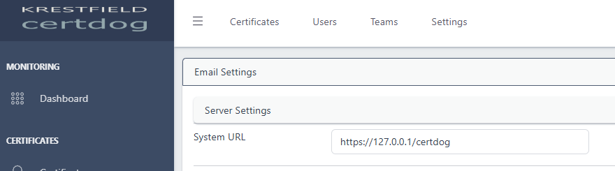
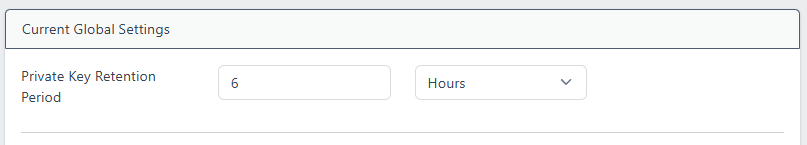

# Certdog Post Installation Configuration

 

Once certdog has been installed, there are a few key pieces of configuration that should be carried out.

 

## Set the system URL

Certdog needs to be told how it will be accessed externally so it can populate the correct URLs for items such as CRL Distribution Points, OCSP end points and email links  

If this is not done, certdog will default to 127.0.0.1 within these URLs  

To set the *System URL*, from the menu click on **Settings** under *MANAGEMENT* and then **Email Settings**:

Update the value for **System URL** to be the **DNS FQDN** at which certdog will be accessed externally. For example, often the server will have a DNS entry such as ``certdog.org.com`` and users would then access certdog via: ``https://certdog.org.com/certdog``. In this case System URL would be updated to that value, I.e. ``https://certdog.org.com/certdog``

Click **Update** to save the setting

 

## Set the logon timer

Initially a user will be logged out after 900 seconds and will then have to re-authenticate. To alter this, navigate to **Settings** then **Settings**. Update these values:

* API Key Total Lifetime
  * This is the total time a user can remain logged in for, assuming they do not exceed the API Key Inactive Timeout value below. E.g. if this were set to 3600 seconds, after 1 hour they would be logged out regardless of how often they interacted with the system

* API Key Inactive Timeout
  * This is the period of inactivity, after which a user will be logged out. E.g. if this were set to 300. If they do not interact with the system for 5 minutes, they will be logged out.

Click **Update** once the chosen values have been set

 

## Set the private key retention period

When a user creates a certificate using the DN Request option, certdog generates the CSR (Certificate Signing Request) and keys on behalf of the user  

Certdog can not retain these keys - in which case the user must download the issued certificate immediately as a PKCS#12

Or certdog can securely store the keys for a period, allowing the user to download the certificate and keys in  PKCS#12/PFX, JKS or PEM formats. After the prescribed time the keys will be deleted  

For example, you could give users an hour during which they may return to the system and download their issued keys/certificates

To set this key retention period, from **Settings** update the **Private Key Retention Period** to the required value:

Click **Update** to save.

 

## Create some CAs

To start issuing certificates, certdog either needs to host its own CAs. Or interface to an external CA  

To create internal CAs, follow this guide:

[Create a Local CA Issuer](https://krestfield.github.io/docs/certdog/create_local_certificate_issuer.html)

To interface to an external Microsoft CA, follow this guide:

[Create an ADCS Issuer](https://krestfield.github.io/docs/certdog/create_adcs_certificate_issuer.html)

And to interface to an external EJBCA CA, follow this one:

[Create an EJBCA Issuer](https://krestfield.github.io/docs/certdog/create_ejbca_issuer.html)

 

## Set the SSL certificate

The server should have a trusted SSL certificate installed, associated with the server DNS name, so that the site is trusted by users  

Follow the steps below to configure this:

[Configure Server's SSL Certificate](https://krestfield.github.io/docs/certdog/configure_server_ssl.html#configuring-the-servers-tls-certificates)

 

## Set up email reminders

To configure email reminders, you need to configure the Email Server settings, then the email details and frequency. See below on how to do this:

[Configure Email Settings](https://krestfield.github.io/docs/certdog/email_settings.html)

 

## Update the Database SSL certificate

The database listens on an SSL connection (in the full version - the demo version does not impose this). This is configured with a default certificate issued from a Krestfield test CA. This certificate should be one issued from your internal trusted CAs  

To update this certificate follow the steps below:

[Update Database SSL Certificate](https://krestfield.github.io/docs/certdog/update_the_db_certificate.html)