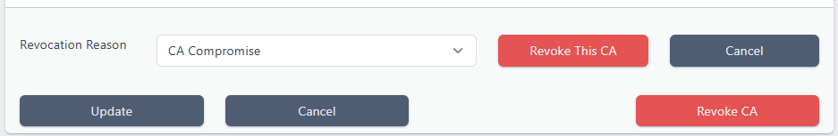
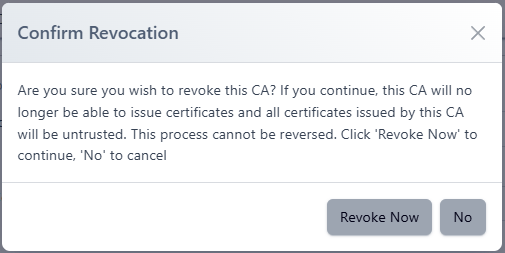
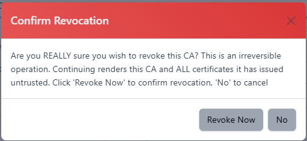
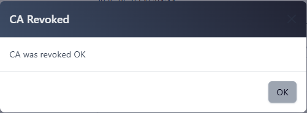
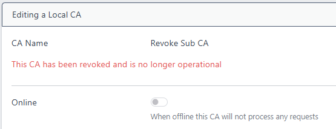

# Revoking a CA

An Internal (Local) CA can be revoked if it meets the following criteria:

* It has been issued from an Internal CA i.e. not from an external CA
  * When a CA has been issued from an external CA, that CA must perform the revocation step

* It is a Subordinate CA. I.e. not a Root CA. 
  * Root CAs cannot be revoked as these CAs are self-signed. Hence, there is no issuer from where valid revocation status can be obtained.

 

CA revocation is a last resort operation, normally only employed in cases such as CA key compromise. Once performed all certificates issued under this CA will fail validation

 

When a CA is revoked, the following occurs:

* The CA certificate is revoked and its serial number will be added to the issuing CA's CRL. OCSP responses from the issuer will return REVOKED.

* The CA will be disabled and no further certificates can be issued from the CA.

 

<b>WARNING: This operation cannot be undone!</b>

 

## Steps to Revoke

To revoke a CA perform the following steps:

1. From the menu, choose **Local CAs** then **CA Configuration**
2. Right click the **CA to be revoked** and click **View/Edit**
   1. Note that this must be a Subordinate CA as Root CAs cannot be revoked
3. Scroll to the bottom of the page and click the **Revoke CA** button

4. Select the **Revocation Reason** and click **Revoke This CA**

5. Click **Revoke Now** to confirm you wish to continue

6. Click **Revoke Now** to finalise the revocation process

The CA is now revoked

 

## Final Steps

Although any revocation from this CA will now be invalid (as the CA itself is revoked) it is good practise to tidy up any connected artifacts

<u>OCSP</u>

If the CA has an associated OCSP server, delete it. If the OCSP server remains, responses from it will not be deemed valid. Once the OCSP signer certificate has expired it will not be able to renew

<u>CRL</u>

Locate where the CRLs are published and remove them. As above, their status will no longer be valid and they will expire without being renewed but this will ensure no clients can use them