# SCEP

> This feature is available from certdog 1.16

 

Certdog supports the SCEP protocol ([RFC8894](https://datatracker.ietf.org/doc/html/rfc8894)) 

Multiple SCEP end points can be created - each with a different configuration. This allows for multiple setups that may provide different certificate types from different CAs

 

## Configuration

From the menu, select **Interfaces** and then choose **SCEP**

Click **Add New SCEP Service**:

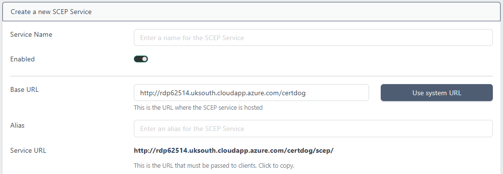

* **Service Name**.  Enter a name. This can be anything to identify the service to the administrators. End users will not see this value
* **Enabled**. This enables the service.  If this is un-checked clients will receive an error indicating that the service is disabled
* **Base URL**. This will be pre-populated using the servers [System URL](post-Installation.html#set-the-system-url). If that value has not been set or you need to alter this value (e.g. if the URL that clients will access uses a DNS address or goes via some load-balancer etc.), then update it here. Click **Use system URL** to revert back to the internally stored system URL
* **Alias**. This is what will define the specific URL for this service, that clients will target for SCEP calls. It is simply appended to the URL to make it unique. It should not contain spaces
* **Service URL**. This is value will be calculated from the Base URL and Alias. This is the value should be provided to clients

 

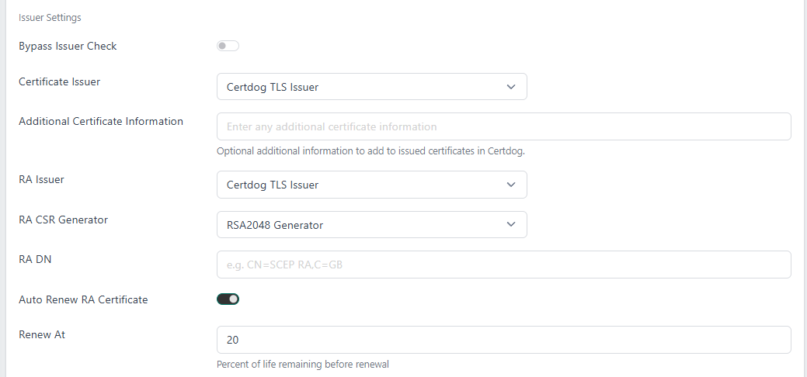

* **Bypass Issuer Check**. If this is checked, Certdog will reject the configuration if the two issuers (certificate and RA) are not connected to the same certificate authority
* **Certificate Issuer**. Choose from the drop down, the issuer from where certificates targeting this service should be issued  from
* **Additional Certificate Information**. Any information entered here will be included as extra information in the generated certificates
* **RA Issuer**. The certificate issuer that will generate the RA certificate
* **RA CSR Generator**. Choose the CSR generator that will be used to create the CSR for the RA certificate
* **RA DN**. Specify the DN for the RA certificate
* **Auto Renew RA Certificate**. If you want certdog to automatically renew the RA certificate, check this box
* **Renew At**. If the above option is checked, set the percentage of life remaining to renew the RA certificate

 

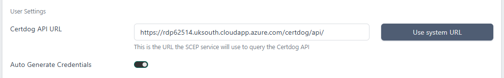

* **Certdog API URL**: This will be pre-populated but should be the URL to the certdog API that will provide the certificates. If certdog is clustered then this may be different to what is automatically populated and should be updated manually

* **Auto Generate Credentials**. If this is checked (the default), then a new user and team will be created, dedicated for this SCEP service. All certificates issued from the service will be associated with this user and team. If this is unchecked then the Certdog Team ID and Certdog User ID fields will be made available and you can enter the values for an existing user and team

 

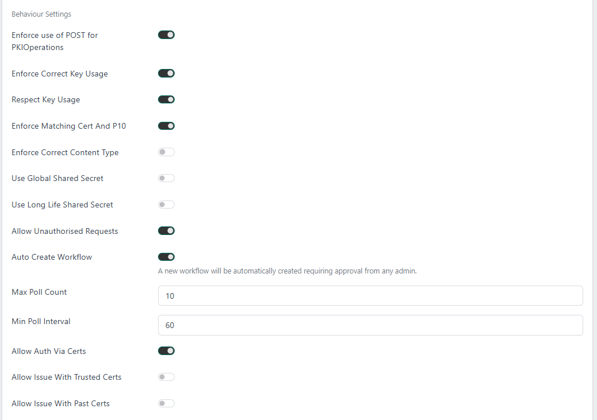

* **Enforce use of POST for PKIOperations**. If enabled, the SCEP service will reject PKIOperation (used when requesting certificates) requests not using POST

* **Enforce Correct Key Usage**. If enabled, the SCEP service will reject requests where the client certificate is missing the digitalSignature key usage

* **Respect Key Usage**. If enabled, the SCEP service will attempt to encrypt responses with the shared secret if the keyEncipherment key usage is not present on the client certificate

* **Enforce Matching Cert And P10**. If enabled, the SCEP service will reject requests where the subject name and public key in a self-signed client certificate do not match those found in the PKCS#10 request

* **Enforce Correct Content Type**. If enabled, the SCEP service will reject requests using a non-standard content type

* **Use Global Shared Secret**. If enabled, the SCEP service will only authorise any requests using the configured global shared secret

* **Use Long Life Shared Secret**. If enabled, the SCEP service will allow shared secrets to be reused forever (or until revoked) by the sender that originally used the secret

* **Allow Unauthorised Requests**. If enabled, the SCEP service will trigger the configured workflow instead of rejecting unauthorised requests, allowing them to be manually approved

* **Auto Create Workflow**. If enabled, the workflow to capture unauthorised requests will be automatically created

* **Max Poll Count**. Set the maximum number of times that a client may poll for an update on the certificate issuance status. Once this number is exceeded the client will receive a failure response

* **Min Poll Interval**. This is the minimum time in seconds between polls. If a client polls more frequently than this period they will receive a failure response with the remaining wait time in the error message

* **Allow Auth Via Certs**. If enabled, requests can be authorised by a trusted certificate, without requiring a shared secret. This only applies to renewal requests by default, unless **Allow Issue With Past Certs** is also enabled

* **Allow Issue With Past Certs**. If enabled alongside **Allow Auth Via Certs**, clients are allowed to request *new* certificates using a trusted certificate without a shared secret, instead of just being able to renew certificates

 

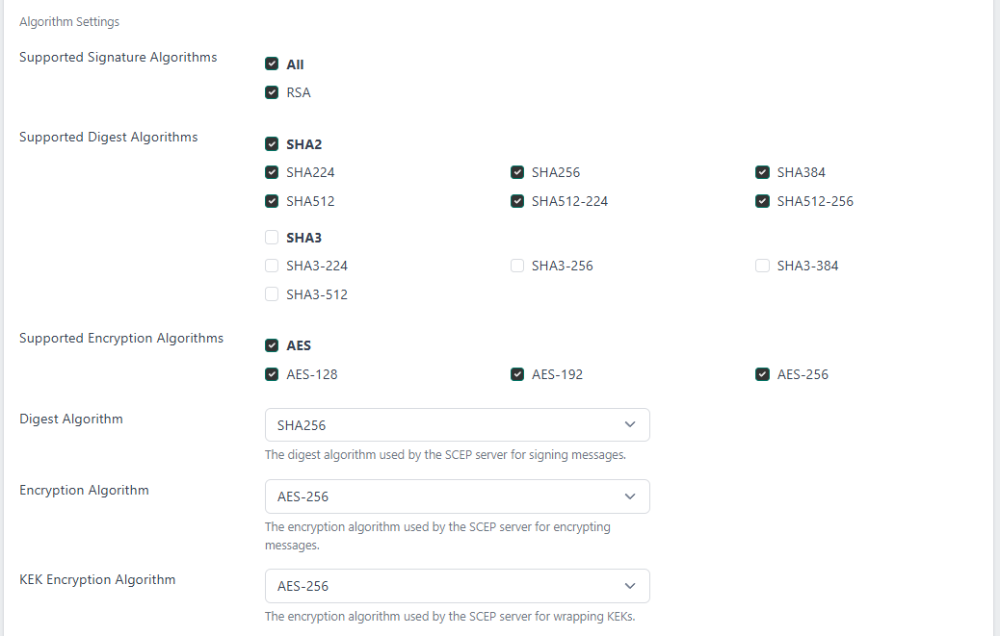

* **Supported Signature Algorithms**. Signing algorithms that must be used by the client
* **Supported Digest Algorithms**. Digest algorithms that must be used by the client
* **Supported Encryption Algorithms**. Encryption algorithms that must be used by the client
* **Digest Algorithm**. The digest algorithm used by the server for responses
* **Encryption Algorithm**. The encryption algorithm used by the server for responses encrypted with certificates
* **KEK Encryption Algorithm**. The encryption algorithm used by the server for responses encrypted with the challenge password

 

Click **Add**

 

### Editing a Service

To edit a service, click the service and choose **View/Edit**:

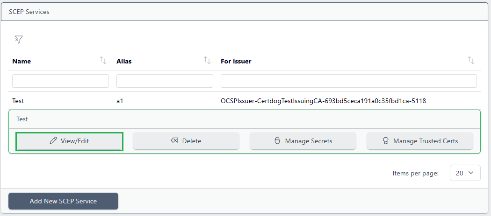

The information previously entered will be displayed and can be edited. Note that if *Auto Generate Credentials* option was previously set, the created *Team* and *User* IDs will now be displayed and can be viewed:

Click **Update** to save the new settings

 

### Disabling a Service

From the SCEP menu, select the service and choose **View/Edit**

Uncheck the **Enabled** button

If a client makes a request when the service is disabled all requests will be rejected

 

### Deleting a Service

From the SCEP menu, select the service and choose **Delete**

Click **Yes** to confirm

 

## Managing Secrets

Secrets are used to allow new clients to request certificates, and optionally can be required for renewing certificates too.
It is expected that these secrets are distributed out-of-band to client devices as needed.
Depending on configuration, these may be single-use or long-lived.

Note if **Use Global Shared Secret** is enabled, all secrets supplied will be tested against the configured global shared secret, and not against any of the other stored secrets.

### Adding a New Secret

Too add a secret, select the SCEP service:

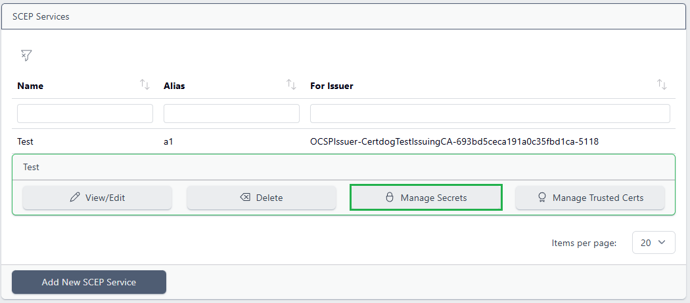

 and choose **Manage Secrets**:

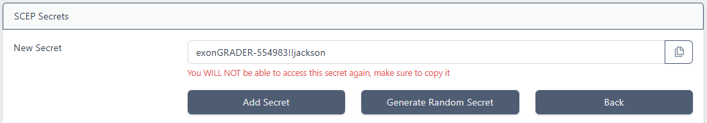

Either enter a secret value, or click **Generate Random Secret** (generating a secret value on your behalf). Click the button to the right of the New Secret text box to copy the value

This value will not be displayed again and must be securely passed to the client

Once copied, click **Add Secret**

 

### Deleting Secrets

Select the SCEP service and choose **Manage Secrets**:

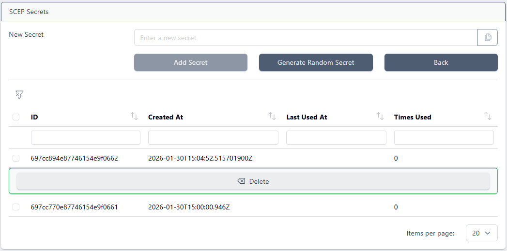

Select the secret to delete and click **Delete**

 

## Trusted Certificates

Trusted certificates can be used to authorise client devices either in addition to or instead of a shared secret.
A client certificate is authorised if it matches a trusted certificate or it was issued by a trusted certificate.

This allows authorising clients which cannot use shared secrets without manually authorising requests.
Additionally, clients can be moved from an old issuer to a new issuer automatically, by trusting all certificates (clients) issued by the previous issuer.

Note because a trusted certificate can be used multiple times to request a new certificate, unlike when using single-use secrets, a malicious client can act as an issuer if marked as trusted.

### Add a Trusted Certificate

Select the SCEP service:

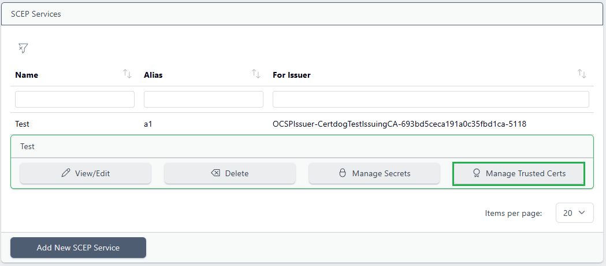

 and choose **Manage Trusted Certs**:

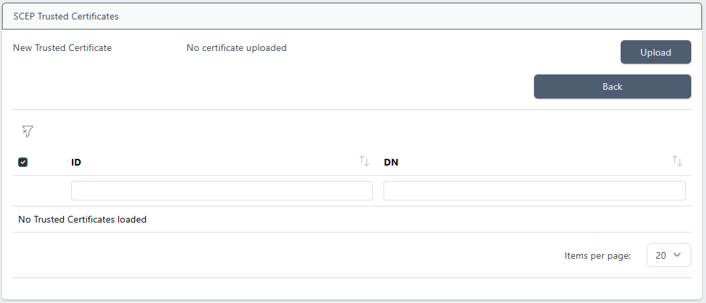

Click Upload and navigate to a PEM formatted certificate, then click Add Trusted Certificate

 

### Delete a Trusted Certificate

Select the SCEP service and choose **Manage Trusted Certs**:

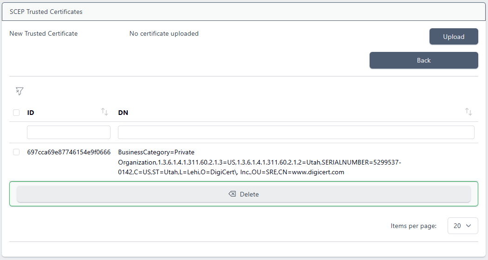

Select the certificate to be deleted and click **Delete**

 

