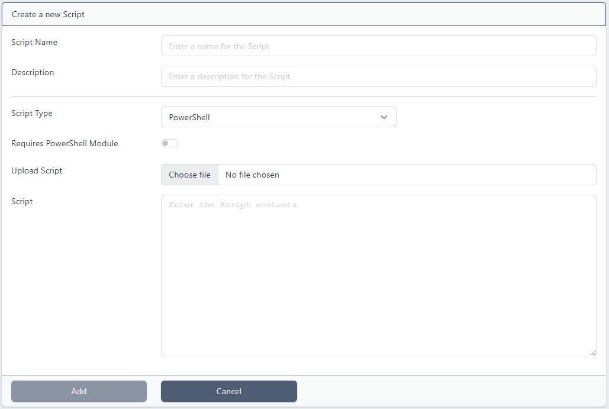
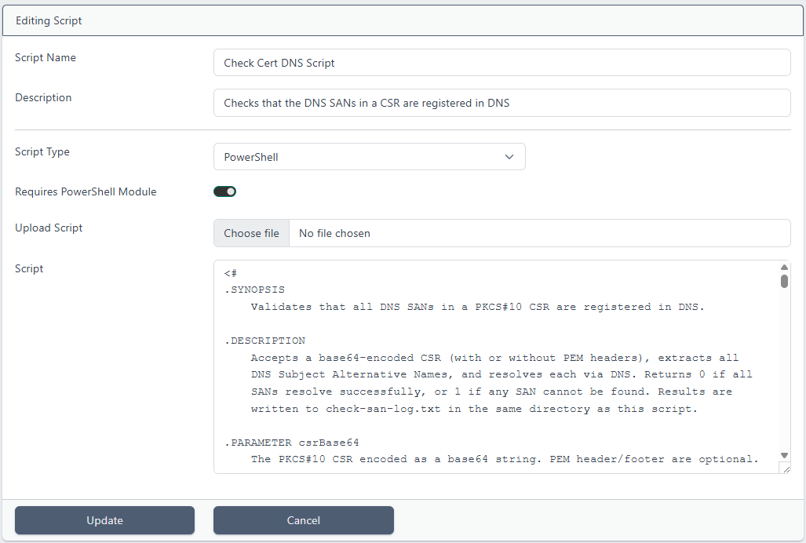

# Scripts

> This feature is available from certdog 1.17

<br>

Certdog supports the running of scripts as part of a [Workflow](workflows.html)

Scripts can be used to carry out operations post certificate processing (request, issuance, revocation etc.), or act as approvers, making decisions on whether certificates may be issued or revoked

Some examples of usage include:

* Creating a ticket (in JIRA or ServiceNow etc.) when a certificate is nearing expiry

* Confirming that the SANs being requested are valid (e.g. registered in DNS) and approving or denying requests

* Push certificate data to another system or database

Scripts can be Shell (Linux) or PowerShell (Windows/Linux) and must be uploaded prior to being specified in a Workflow

<br>

## Adding a Script

From the menu, select **Scripts** and then click **Add New Script**:



The following information must then be entered:

* **Script Name**.  Enter a name for the script (this does not have to be the actual PowerShell or Shell script name

* **Description**. Enter a description (optional)

* **Script Type**. Choose either Shell or PowerShell. This determines what the script will be run with. In the [Settings](settings.html) menu, there are entries for *PowerShell Processor* and *Shell Processor* which are set to *powershell.exe* and *sh* by default, but these can be updated if required

* **Requires PowerShell Module**. If the *Script Type* is **PowerShell**, this option is available. When checked the [Certdog PowerShell module](powershell_module.html) will be made available to the running script enabling the script to make use of the module's functions in order to call back into certdog. When specifying in a workflow, the ``[APITOKEN]`` is usually also passed to the script, allowing the script to authenticate to the certdog API

* **Upload Script**. If the script resides on disk, click **Choose file** to navigate to this script, alternatively the script can be typed/pasted in to the *Script* section

  Note: Choosing a script in this way uploads the contents to the system. The file chosen will not be executed itself. If any changes to that file are made, it must be re-uploaded. This is to prevent uncontrolled external changes

* **Script**. Type or paste in the script data here. If *Upload Script* is chosen, the script contents will be displayed here. The script can be edited here now and when managing scripts later

Click **Add**

The script will now be available as an optional script in [Workflows](workflows.html)

<br>

### Editing/Deleting Scripts

From the menu, select **Scripts**:


Clicking on a script will preview the script contents as well as provide the **View/Edit** and **Delete** options:


To delete, click **Delete**. To edit click **View/Edit**:



The script may be edited directly in the *Script* section or a new script uploaded.

When done, click **Update**

<br>

### Notes on Developing Scripts

Scripts will be run by the same account that is running the Certdog service. In Windows this will, by default be LOCAL SYSTEM, on Linux this will be whatever account has been configured to run the service

Therefore, the scripts will only have the same permissions as those accounts. However, the LOCAL SYSTEM account is highly privileged

<br>

When uploading scripts be sure to examine contents and satisfy yourself that the script will be safe to run. Especially if uploading one not developed by trusted parties. The purpose of scripts being uploaded in this way is intentional, to force a review and prevent external scripts being tampered with or swapped

<br>

When a script is specified in a Workflow, several parameters may be passed, e.g.

* ``[APITOKEN]``
  * A temporary API authentication token that will enable the script 
* ``[CERTDATAB64]``
  * The certificate data in Base64 format (without any header and footer)
* ``[CERTSUBJECT]``
  * The DN of the certificate

etc.

(See [Parameters](parameters.html) for the full list)

<br>

For example, if our PowerShell script accepted the following parameters:

```powershell
param (
    [Parameter(Mandatory = $true]
    [string]$certId,
    [Parameter(Mandatory = $true]
    [string]$certSubject,
    [Parameter(Mandatory = $true]
    [string]$caller
)
```

These parameters could be passed in the correct order. e.g. ``[CERTID] [CERTSUBJECT] "Workflows"``

Alternatively parameter names can also be specified, in which case the order would not matter e.g. ``-certId [CERTID] -caller "Workflows" -certSubject [CERTSUBJECT]``

See [Workflows](workflows.html) for more information on configuring scripts to run as part of a workflow


<br>

