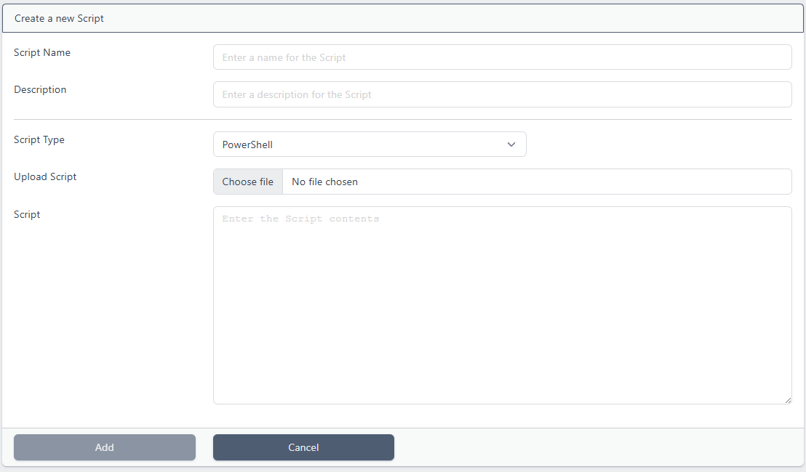
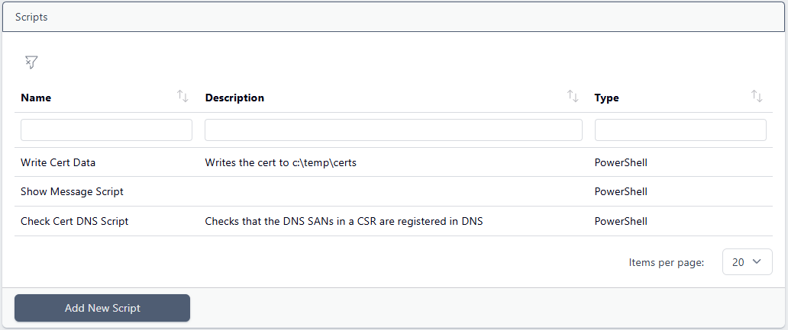
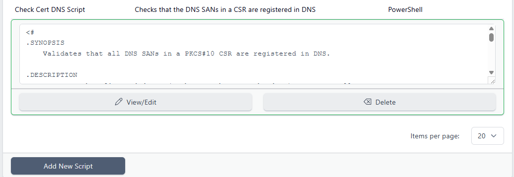
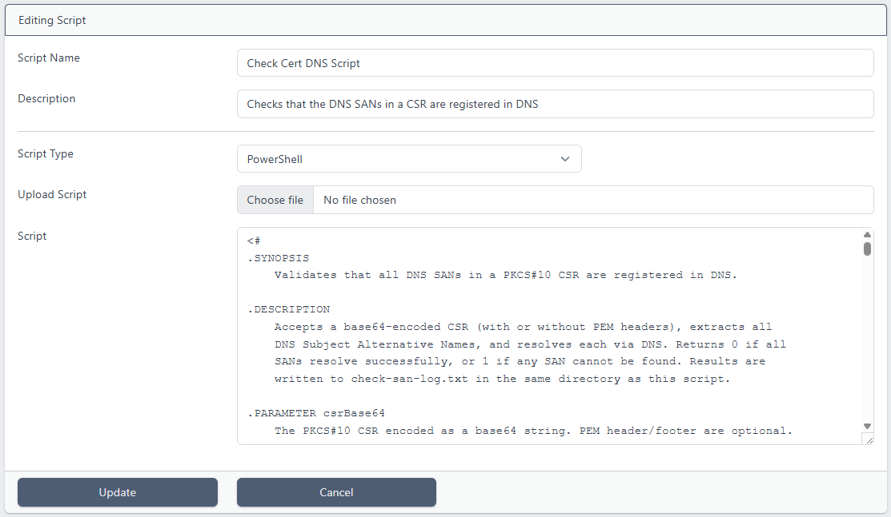

# Scripts

> This feature is available from Certdog 1.17

<br>

Certdog supports the running of scripts as part of [Workflows](workflows.html) and [Tasks](tasks.html)

Scripts can be used to carry out operations post certificate processing (request, issuance, revocation etc.), or act as approvers, making decisions on whether certificates may be issued or revoked. Or run regular tasks.

Some examples of usage include:

* Creating a ticket (in JIRA or ServiceNow etc.) when a certificate is nearing expiry

* Confirming that the SANs being requested are valid (e.g. registered in DNS) and approving or denying requests

* Push certificate data to another system or database

* Synchronising an AD CS database with the Certdog inventory

* Generating weekly reports

Scripts can be Shell (Linux) or PowerShell (Windows/Linux) and must be uploaded prior to being specified in a Workflow

<br>

## Adding a Script

From the menu, select **Scripts** and then click **Add New Script**:



The following information must then be entered:

* **Script Name**.  Enter a name for the script (this does not have to be the actual PowerShell or Shell script name

* **Description**. Enter a description (optional)

* **Script Type**. Choose either Shell or PowerShell. This determines what the script will be run with. In the [Settings](settings.html) menu, there are entries for *PowerShell Processor* and *Shell Processor* which are set to *powershell.exe* and *sh* by default, but these can be updated if required

* **Upload Script**. If the script resides on disk, click **Choose file** to navigate to this script, alternatively the script can be typed/pasted in to the *Script* section

  Note: Choosing a script in this way uploads the contents to the system. The file chosen will not be executed itself. If any changes to that file are made, it must be re-uploaded. This is to prevent uncontrolled external changes

* **Script**. Type or paste in the script data here. If *Upload Script* is chosen, the script contents will be displayed here. The script can be edited here now and when managing scripts later

Click **Add**

The script will now be available as an optional script in [Workflows](workflows.html) and [Tasks](tasks.html)

<br>

### Logging

Output from scripts is written to the local text log (.e.g. c:/certdog/logs/ezsign.log). For example, the following PowerShell:

```powershell
Write-Host "-- Import from ADCS Starting --------------------"
Write-Host "   Importing 56 certificates from scca1.cromer.org\CA1..."
Write-Host "-------------------------------------------------"
```

Would result in the following log entries in the text logs:

```
2026-07-02 10:03:00.013 DEBUG certdogapi - [system] Running Task 'Import from ADCS'.
2026-07-02 10:03:00.037 DEBUG certdogapi - [system] Running script 'Import from ADCS'. Command: powershell.exe -File C:\certdog\scripts\57892009024066169511.ps1 -apiToken [APITOKEN] -apiUrl https://cd.cromer.org/certdog/api/
2026-07-02 10:03:00.287 DEBUG certdogapi - Script 'Import from ADCS' exited with code '0' output:
-- Import from ADCS Starting --------------------
   Importing 56 certificates from scca1.cromer.org\CA1...
------------------------------------------------
```

The log entries available via the UI (and API) contain fewer details (not the script output), to avoid clutter. E.g.

```
2026-07-02 10:03:00 Running Task 'Import from ADCS'.
2026-07-02 10:03:00 Running script 'Import from ADCS'. Command: powershell.exe -File C:\certdog\scripts\57892009024066169511.ps1 -apiToken [APITOKEN] -apiUrl https://cd.cromer.org/certdog/api/
```

<br>

### Editing/Deleting Scripts

From the menu, select **Scripts**:



Clicking on a script will preview the script contents as well as provide the **View/Edit** and **Delete** options:



To delete, click **Delete**. To edit click **View/Edit**:



The script may be edited directly in the *Script* section or a new script uploaded.

When done, click **Update**

<br>

### Notes on Developing Scripts

Whether activated via a Workflow or Task, scripts will be run by the same account that is running the Certdog service. In Windows this will, by default be LOCAL SYSTEM (the account the Certdog Service is running under). On Linux this will be whatever account has been configured to run the service

Therefore, the scripts will only have the same permissions as those accounts

<br>

When uploading scripts be sure to examine contents and satisfy yourself that the script will be safe to run before committing. Especially if uploading one not developed by trusted parties. The purpose of scripts being uploaded in this way is intentional, to force a review and prevent scripts from being tampered with or swapped (e.g. if they were held on the file system)

<br>

When a script is specified in a Workflow or Task, several parameters may be passed. E.g.

* ``[APITOKEN]``
  * A temporary API authentication token that will enable the script to authenticate back to the Certdog API (directly or via the Certdog PowerShell module), enabling it to obtain additional information (or make updates, if permissions allow)
* ``[CERTDATAB64]``
  * The certificate data in Base64 format (without any header and footer)
* ``[CERTSUBJECT]``
  * The DN of the certificate

etc.

What parameters are available depend on if running as a Script or Workflow. See [Parameters](parameters.html) for the full list

<br>

For example, if our PowerShell script accepted the following parameters:

```powershell
param (
    [Parameter(Mandatory = $true]
    [string]$certId,
    [Parameter(Mandatory = $true]
    [string]$certSubject,
    [Parameter(Mandatory = $true]
    [string]$caller
)
```

These parameters could be passed in the correct order. e.g. ``[CERTID] [CERTSUBJECT] "Workflows"``

Alternatively parameter names can also be specified, in which case the order would not matter e.g. ``-certId [CERTID] -caller "Workflows" -certSubject [CERTSUBJECT]``

See [Workflows](workflows.html) for more information on configuring scripts to run as part of a workflow and [Scripts](scripts.html) for running regular tasks

<br>

You can also use the [Certdog PowerShell Module](powershell_module.html) within a script. The module is always written to the `scripts` folder before a PowerShell script is run, so you can import the module using a relative path.

```powershell
param(
    [Parameter(Mandatory = $true)]
    [string] $ApiToken
)

Import-Module .\certdog-module.psm1

Set-ApiToken -authToken $ApiToken
...
```

By default, the API URL is formed by adding `/api/` onto the system URL, and this is written to a configuration file picked up by the PowerShell module so does not need to be explicitly specified when using the PowerShell module. However, it is also available as a parameter (e.g. when calling the REST API directly) or can be provided explicitly

When using the PowerShell module you can override this URL as described in the [Certdog PowerShell Module](powershell_module.html) documentation. E.g.

```powershell
Set-ApiUrl -url "https://path/to/your/api/"
```

<br>

