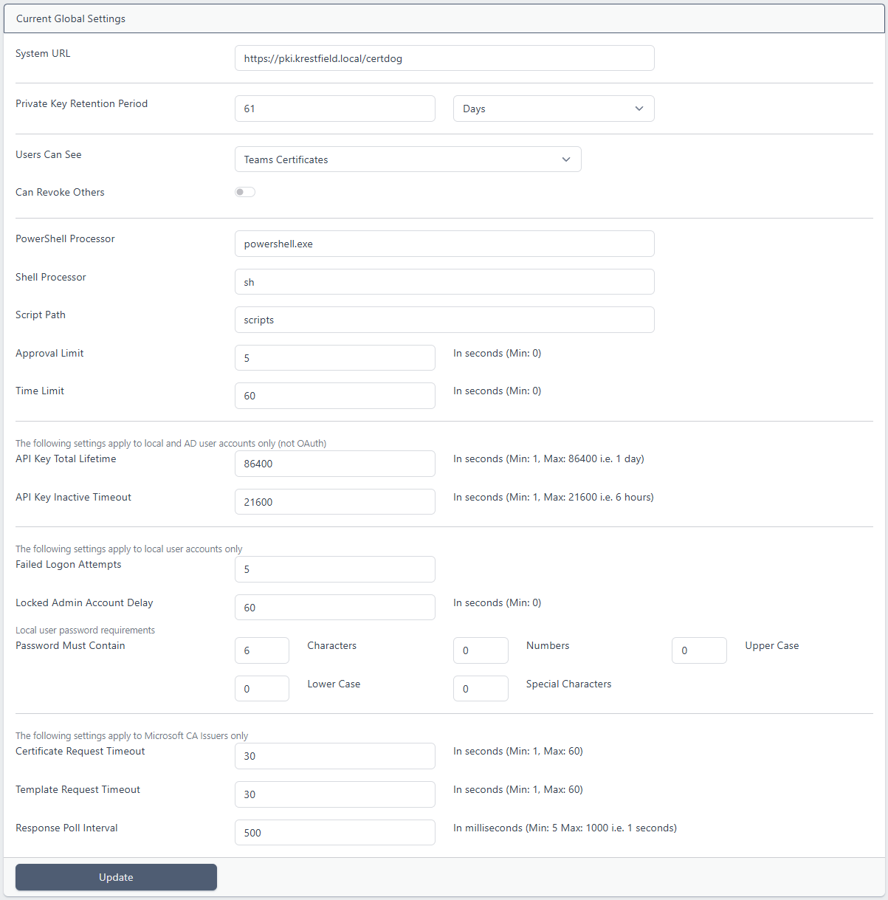

# Certdog Settings

The settings can be viewed by selecting the **Settings > Settings** option on the menu

 

* System URL

  * In order for the URLs to be correct (as sent out in emails/notifications and used by services such as ACME), you must enter a value for **System URL**. This must be the server name and location a user would use to access the system

  * The server name will be the DNS name and by default, the location will be **/certdog** (but this can be changed depending on how you host the system)

  * As an example, on initial setup you may access the login page here:

    https://127.0.0.1/certdog/ui/#/login

  * In this case you would set the *System URL* to be:

    https://127.0.0.1/certdog

  * Later, when you configure your DNS entries, you may access the server at:

    https://pki.krestfield.local/certdog/ui/#/login

  * So now the *System URL* would be:

    https://pki.krestfield.local/certdog

 

* Private Key Retention Period

  * If a user generates a certificate using the *Request DN* option, then certdog also generates the keys and CSR. This period defines for how long this data will be retained by the system

  * Whilst the key data is retained the owner of the certificate can return to the system and download the certificate as a PKCS#12, JKS or PEM file. Once this period has expired, this data will be purged from the system and will no longer be available

 

* Users can see

  * This determines what certificates a user can see, options are:
    * Own Certificates Only. The user can only see certificates that they are the owners of
    * Teams Certificates. As well as certificates the user owns, users can also see all certificates that are assigned to teams that they are a member of
    * All Certificates. Users can see all certificates in the system

  * Note that even if users can see the certificates, they can only download keys associated with a certificate (PKCS#12, JKS, PEM etc.) they are the owner

* Can Revoke Others
  * Only available if *Teams Certificates* or *All Certificates* are chosen for *Users can see*
  * With this option switched off, users can only revoke their own certificates, regardless of whether they can view their teams or all certificates. When checked, they are also permitted the revoke any certificates they have visibility of

 

* PowerShell Processor
  * When PowerShell scripts are executed by Workflows, this is the command that will be used to run those scripts. Usually powershell.exe will be available on Windows systems but if this is not in the path available to Certdog, or installed somewhere else, you may provide the exact location here e.g. ``C:\modules\powershell.exe``
* Shell Processor
  * When Certdog is running on a Linux based OS, this is the shell processor that will be used to run the shell scripts. This could be changed to another shell e.g. bash if preferred
* Script Path
  * The location on the file system, relative to the installation where the scripts will temporarily be written to when being executed
  * If Certdog is running on a read-only file system (e.g. in a kubernetes setup), you may need to update this to point to another mounted volume
* Approval Limit
  * The number of seconds a script is allowed to block for when it is used as an approval. After this limit, the API will create an *approval* to be approved or rejected by the script when it is finished instead of processing the request immediately
* Time Limit
  * The total number of seconds a script can run for before it is forcibly ended by Certdog

 

* API Key Total Lifetime

  * When a user logs in successfully, an authorisation token (or API key) is returned which the user (or user interface) uses to authenticate from then on
  * This value determines for how long that token/key can be used before it expires. When it expires a user will be required to re-authenticate - even if they are still using the system
  * It can be set to last for up to 24 hours (86400 seconds) but in reality this figure will not normally be reached as systems using the API will be logging in and logging off as they call the API and a user is unlikely to be continually using the UI for that period of time
  * If you want to enforce users or systems to authenticate more frequently (you may not want systems calling the API to retain a valid key for a long period), reduce this figure

* API Key Inactive Timeout

  * This is the period after which a user will be logged out of the system if they have not carried out any operation

  * The API Key Total Lifetime value will only be reached if the system is continually being called within the API Key Inactive Timeout value

 

  * Failed Login Attempts
    * This setting determines how many failed logins are permitted before before the account is locked (for standard user accounts) or starts to out be levied with a delay (for Administrator accounts)

  * Locked Admin Account Delay
    * This setting applies to Administrator accounts only. Administrator accounts do not get locked out completely but they start to experience delays between logon attempts. This is the delay period that is applied after an Administrator account fails to logon after *Failed Login Attempts*

  * Password Must Contain
    * This is the password complexity that will be enforced on new and updated passwords

 

* Certificate Request Timeout
  * When a certificate request is made to a Microsoft CA, this is the time the system will wait for a response before it assumes the CA is down or non-contactable

* Template Request Timeout
  * As above but this timeout occurs when attempting to obtain the list of templates from the CA

* Response Poll Interval
  * This is the time the API will wait (in milliseconds) before checking if the ADCS Agent has obtained a certificate. If you have a fast CA, this can be reduced for more responsiveness 

