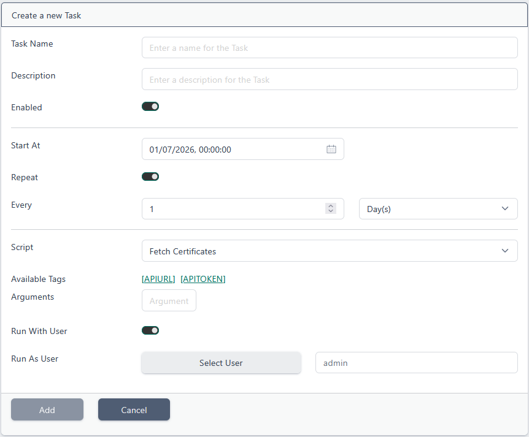
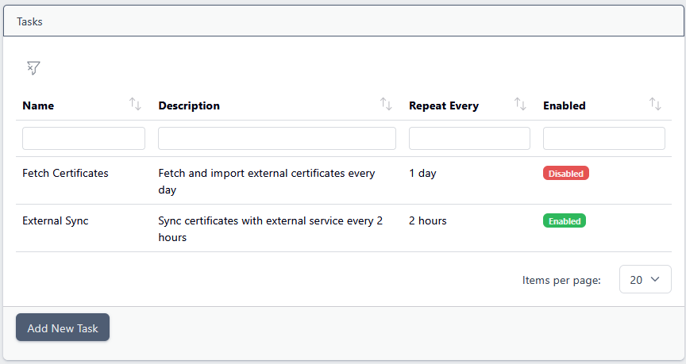
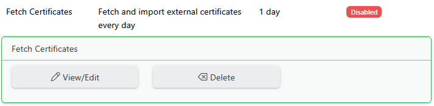
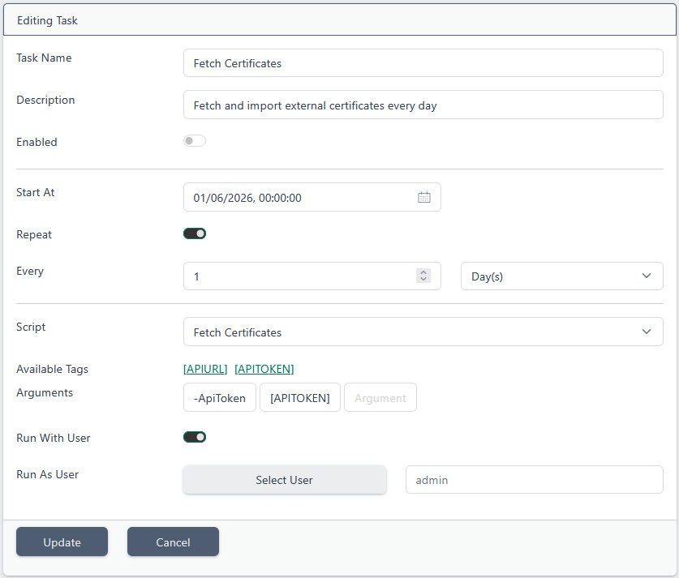

# Tasks

> This feature is available from Certdog 1.17

 

Certdog supports the running of regularly scheduled or one-off tasks using [Scripts](scripts.html)

These tasks can be used to carry out operations which do not have a specific event associated with them. In cases where a script should be run in response to an event, use [Workflows](workflows.html)

Some examples of Task operations include:

* Running a daily/weekly TLS scan
* Synchronising with an Microsoft AD CS database, by regularly querying AD CS for newly issued certificates

* Checking another system for queued requests and processing

* Producing weekly reports detailing all certificates issued during that time

 

## Adding a Task

From the menu, select **Tasks** and then click **Add New Task**:

The following information must then be entered:

* **Task Name**

  Enter a name for the Task

* **Description**

  Enter a description (optional)

* **Enabled**

  Select whether the Task runs or not

* **Start At**

  Enter the start time of the Task. For non-repeating Tasks, this will be the only time they run. Otherwise this is when the regular tasks will begin

* **Repeat**

  Check this option if you wish the task to be run regularly

* **Every**

  If the Task is set to *Repeat*, this is the delay between executions of the Task

  E.g. to run a task at 08:00 every day. Set *Start At* to 08:00, check the *Repeat* option, and specify *1 Day(s)* as the value for *Every*

* **Script**

  Select the Script to run every time the Task is triggered.

* **Arguments**. Enter arguments to pass to the Script when the Task is run. See [Parameters](parameters.html) for more details on specific tags. Only **[APIURL]** and **[APITOKEN]** are available for Tasks. You must enable **Run With User** to use **[API TOKEN]**.

* **Run With User**. Select whether the Task should be run as a specific user or not. This is required to automatically generate an API token.

* **Run As User**. Select the user to run this Task with. API tokens requested by the Script's arguments will be generated using this user.

Click **Add**

 

## Editing/Deleting Tasks

From the menu, select **Tasks**:

Clicking on a Task will provide the **View/Edit** and **Delete** options:

To delete, click **Delete**. To edit click **View/Edit**:

When done, click **Update**

 

## Notes on Repeating Tasks

When a Task is set to repeat, it is run every interval after the start time. To prevent multiple APIs from running the same task at once, the Task is locked when the associated script is started. The lock lasts the same amount of time as the configured script **Time Limit** (see [Settings](settings.html)). As a result, Tasks are only able to run as often as the script **Time Limit** allows.

While repeating Tasks should only run once every repeat interval (irrespective of success status), you are encouraged to design your Tasks to gracefully handle being called multiple times within their repeat intervals.

 
