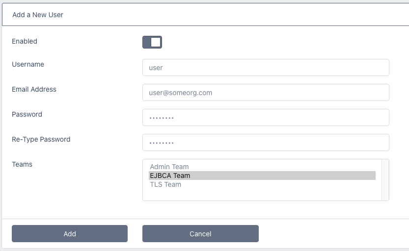

# Users

A user can authenticate via the UI or to the API (See [REST API](rest_api_overview.html))  
A user account can be a member of a team and, via the team permissions, then has access to specific Certificate Issuers  

Users may also be sent emails on certificate issuance and reminders when certificates are nearing expiry    

---
### Creating a User Account
As an administrator, select **Users** from the menu  
Click **Add New User**  

Enter a **username**, an **email address** (email address is mandatory)  and a **password** for the account  

You may choose what team(s) to add the user to. Note that if no team is chosen, the user will be able to login but will be unable to request any certificates as *Certificate Issuer* permissions are managed at the team level  

Click **Add**

---

### Editing and Deleting Users

Select Users from the menu and click on the user account you wish to update  

Click **Edit** or **Delete** as required  

Note that when editing a user, if you do not enter a new password the existing password will remain set. Thus, you may edit the email address, team membership and whether the account is enabled or not without having to reset the password

