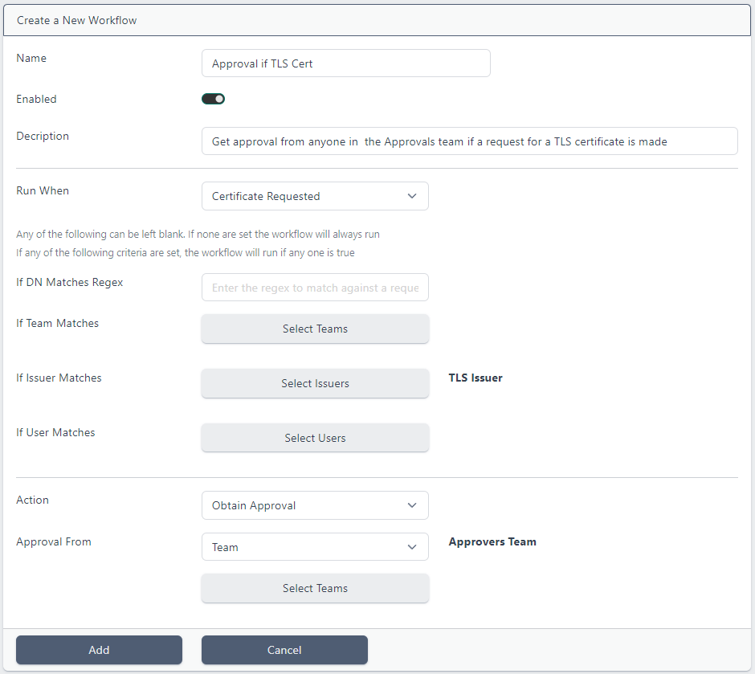
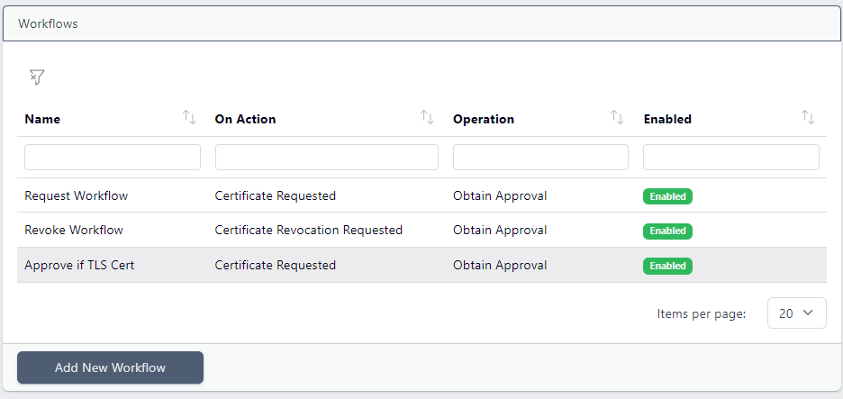
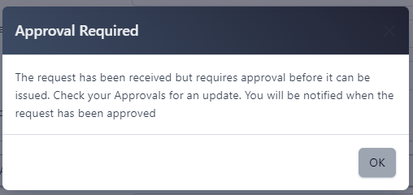
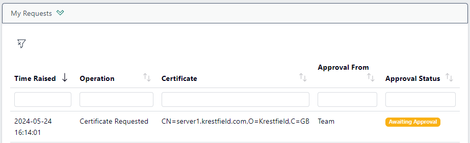
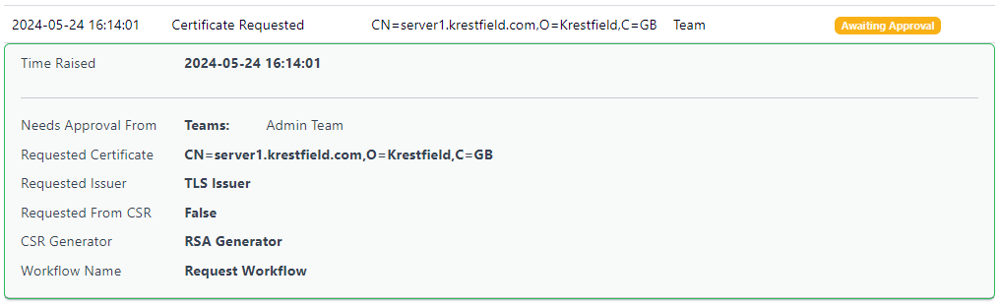
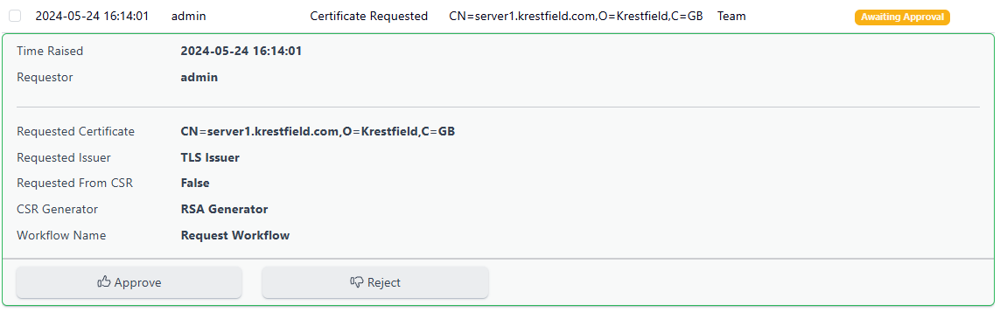
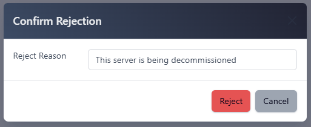
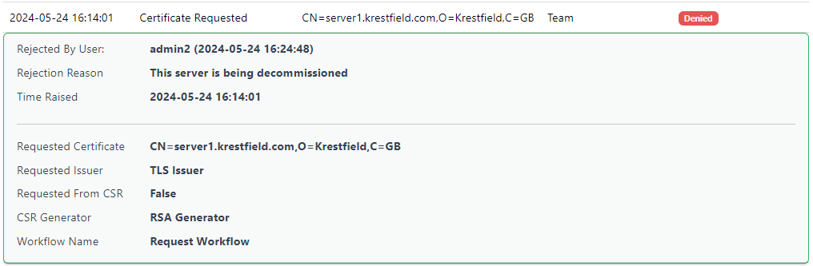

# Certdog - Workflows


> From version 1.11


Workflows allow for the pausing of certificate issuance or revocation until approval is obtained. They can also be configured to run a script when one of these events occurs.  

A workflow can be configured to activate based on the following criteria:

* If the requested (or revoking) DN matches a pattern

* If the request is from a user in a particular team (or teams)

* If the request is for a particular certificate issuer (or issuers)

* If the request is from a particular user (or users)

  

Once activated either a script can be run, or approval requested. If approval is requested this can be configured to be from any of the following:

* Any Administrator
* A particular user (or users)
* Any user in a particular team (or teams)

Individuals who match the above criteria may then approve the request. After which the original operating will be completed and a notification (as an email) sent to the original requestor.  


## Configuration

Click the **Workflows** menu under the **ADMINISTRATION** section and click **Add New Workflow**:



Enter a *Name* for the workflow and optionally a *Description*  

Choose when the workflow should run. The options are:

* **Certificate Requested**

* **Certificate Revocation Requested**

  

Next choose any criteria that must be satisfied for this workflow to be triggered. If none are selected then the Workflow will always be triggered. If multiple options are selected (e.g. *If Team Matches* and *If User Matches* are set) then if either are true, the Workflow will be triggered. 

The following options are available here:

* **If DN Matches Regex**
  * Enter a regular expression that will match against a DN. See the section at the end of this page for samples of regular expressions.

* **If Team Matches**
  * Click **Select Teams** and select one or more teams. If a user in any of these teams makes the request, the Workflow will activate
* **If Issuer Matches**
  * Click **Select Issuers** and select one or more Certificate Issuers. If a request is made from one of these Certificate Issuers, the Workflow will activate
* **If User Matches**
  * Click **Select Users** and select one or more Users. If a request is made from any of these Users, the Workflow will activate


Next, select the action if any of the configured matches apply. The options are:

* **Run Command**

* **Obtain Approval**

  

<u>Run Command</u>

If **Run Command** is selected, enter the command to execute. This could be a PowerShell script, bash script or any other command or application. Note that the account running the certdog service must have permissions to run the script/application. 

When running a PowerShell script ensure the ``powershell.exe`` part is included. For example, to run the following PowerShell command:

```
Get-Date > "c:\temp\date.txt"
```

You would need to enter:

```
powershell.exe -command Get-Date > "c:\temp\date.txt"
```


<u>Obtain Approval</u>

When **Obtain Approval** is selected, the *Approval From* options are:

* **Any Admin**
  * If this option is chosen, any Administrator will be able to approve the request

* **User**
  * Click **Select Users** and select one or more Users who can approve the request

* **Team**
  * Click **Select Teams** and select one or more Teams, members of which can then approve the request

Note: That that the same user cannot approve their own requests, even if they meet the approval criteria. For example if an Administrator makes a request and approval is set to be from Any Administrator, another Administrator must still approve.

Click **Add**



The new Workflow will now appear in the Workflows list.  

To make changes, click the **Workflow** and choose **View/Edit**.


---


## Approvals

All Approvals are available from the Approvals menu item. This section shows 

* **My Requests**
  * Requests that you have made and their approval status (**Awaiting Approval**, **Approved** or **Denied**)
* **Requests I Can Approve**
  * This list shows all requests that you are permitted to approve

  


### Requestors

When a user makes a request that is caught by a Workflow, they will be presented with a message such as:



And they will be taken to the *Approvals* section:



Clicking on an item in the list will show the approval details, including who it needs approval from:



When this request is approved the Approval Status will change to *Approved* and the details will show the approver's username and approval time. The requesting user will also receive an email informing them that their request has been approved.

If the request is denied, the status will show *Denied* and the request will show relevant details.


### Approvers

From the **Approvals** menu item, under the **Requests I Can Approve** section will show the requests awaiting your approval.

Click on an item to obtain more details about the request:



Click **Approve** or **Reject**.  

If *Reject* is chosen there is the option to enter a reason:



The requesting user will receive an email indicating whether the request was accepted or not. In the *My Requests* list of the *Approvals* section, the request will be updated with the new status.  Clicking on the item will show more details:




## Matching DNs with Regular Expressions

You may activate a workflow when a request DN matches a regular expression  

If you wanted to match an exact DN, simply enter that text. However, note this will not catch any variations such as spaces or case  

To capture a DN that includes a specific string (e.g. domain name), case insensitive, you could use:

```
(?i).*krestfield.com.*
```

This would then capture requested DNs such as:

```
CN=server1.krestfield.com,O=Krestfield,C=GB
```

But would not capture:

```
CN=server1,O=Krestfield,C=GB
```

etc.

By utilising regular expressions it is possible to capture more complex variations

