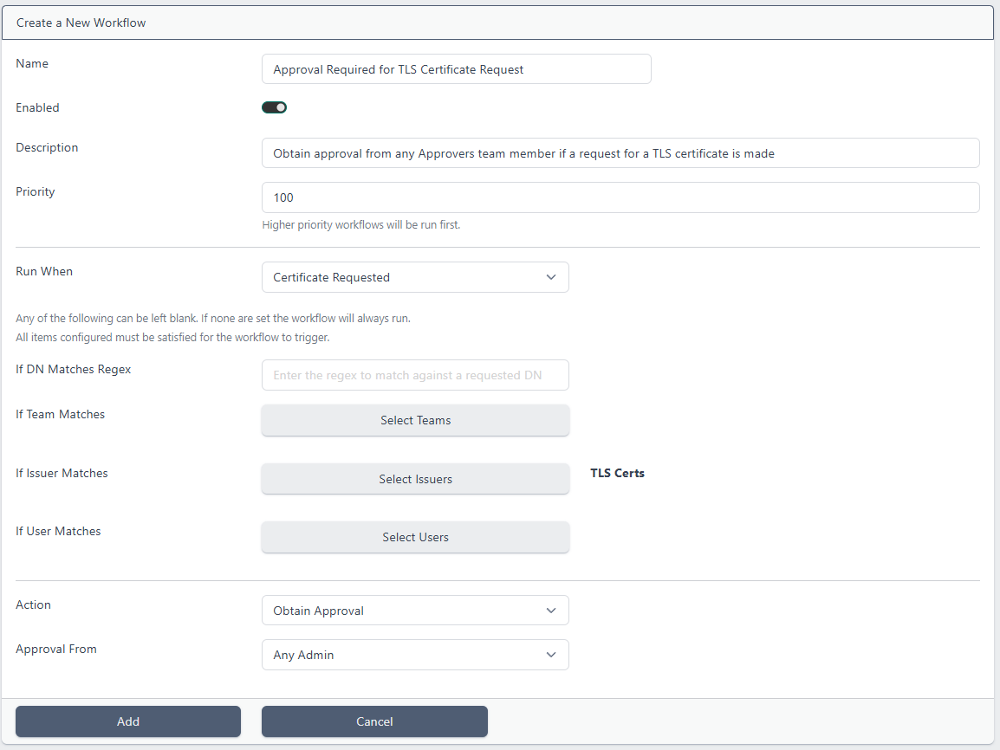
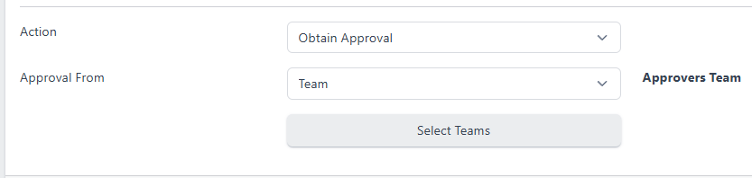
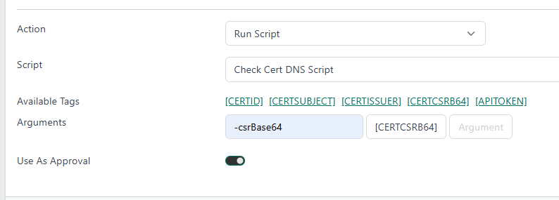
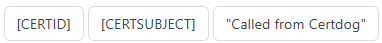
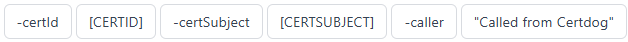
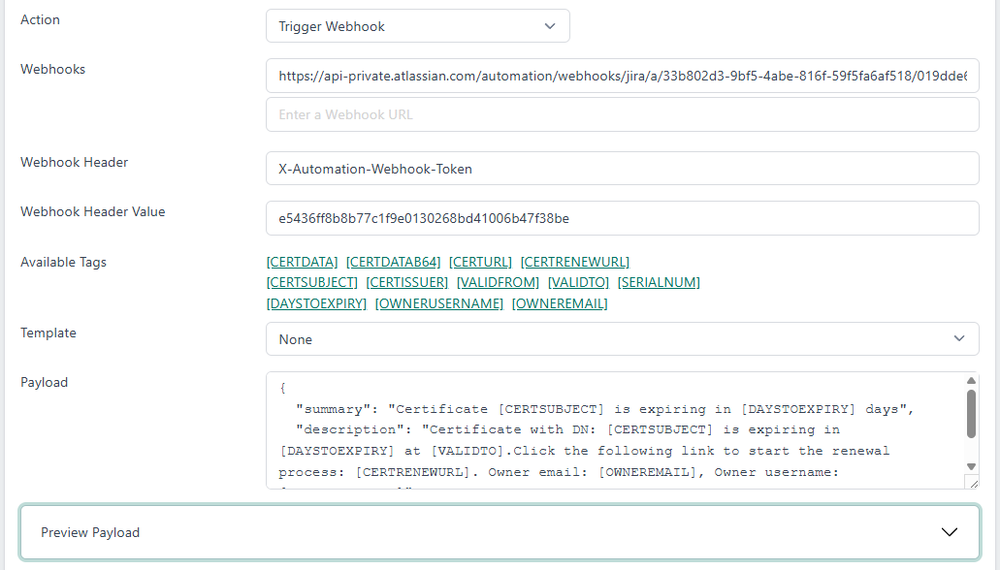

# Certdog - Workflows


> From version 1.17


Workflows operate on a Trigger, Filter, Action process. Some event (such as a certificate request) will trigger a workflow, the filter will then decide if the action should be carried out (such as the request was from a specific team) and if the filter passes, the action is carried out  

Triggers can be:

* Certificate Requested

* Certificate Revocation Requested

* Certificate Issued

* Certificate Revoked

* Certificate Imported

* Certificate Deleted

* Certificate Expiring

Any of these operations carried out by a user/system will trigger all workflows listening for that particular trigger 

There is a Priority that can be assigned to triggers - thus, if several Workflows will be triggered, they will be executed in order of priority - the highest priority being run first (e.g. a Priority of 100 runs before a Priority of 90)

<br>

Filters can be on the requested (or issued certificate) DN or matched on Teams, Issuers or Users. Every item in the filters must match for the trigger to be actioned. For example, if set to filter on Team is *Middleware* and Issuer is *TLS Certificates*, then the request must be from a user in the *Middleware* team, requesting a certificate from the *TLS Certificates* Issuer. In other words filters use the AND operator (not the OR)

<br>

Actions can be any of the following:

* Obtain Approval
  
  Approval must be obtained from another user, an Administrator or a member from another team
  
* Run Script
  
  A script (PowerShell or Shell/Bash) can be run and provided with parameters from the request e.g. the certificate subject

  There is an option to *Use as Approval*. When this is checked, this enables automated approval based on the output from script. If the script returns 0, the request will proceed, otherwise it will be reject
  
* Send Email
  
  An email can be sent. These can be sent to the owner or specified email addresses containing relevant information
  
* Trigger Webhook
  
  A webhook can be called. This can be used to send notifications to systems such as Microsoft Teams or JIRA etc 

<br>

## Configuration

Click the **Workflows** menu under the **ADMINISTRATION** section and click **Add New Workflow**:



Enter a *Name* for the workflow and optionally a *Description*  

If you expect multiple workflows to match the same criteria (and so will be run together) and you care about the order, set the Priority. A higher value (e.g. 10) will run before a lower priority (e.g. 1)

Choose when the workflow should run. The options are:

* **Certificate Requested**

  Triggered whenever a certificate is requested. Via any interface (UI, REST API, ACME, SCEP etc.) and any mechanism (CSR or providing a DN)

* **Certificate Revocation Requested**

  Triggered whenever a revocation request is placed via any interface

* **Certificate Issued**

  Triggered after a certificate has been issued

* **Certificate Revoked**

  Triggered after a certificate has been revoked

* **Certificate Imported**

  Triggered after a certificate has been imported

* **Certificate Deleted**

  Triggered after a certificate has been deleted

* **Certificate Expiring**

  Triggered when a certificate is expiring within the set number of days


Next choose any criteria that must be satisfied for this workflow to be triggered. If none are selected then the Workflow will always be triggered. If multiple options are selected (e.g. *If Team Matches* and *If User Matches* are set) then if both are true, the Workflow will be triggered

The following options are available here:

* **If DN Matches Regex**
  
  Enter a regular expression that will match against a DN. See the section at the end of this page for samples of regular expressions
  
* **If Team Matches**
  
  Click **Select Teams** and select one or more teams. If a user in any of these teams makes the request, the Workflow will activate
* **If Issuer Matches**
  
  Click **Select Issuers** and select one or more Certificate Issuers. If a request is made from one of these Certificate Issuers, the Workflow will activate
* **If User Matches**
  
  Click **Select Users** and select one or more Users. If a request is made from any of these Users, the Workflow will activate
  
* **If Expires in Days**

  * This option is only available if **Certificate Expiring** is the selected trigger
  * One or a series of *number of days before expiry* can be specified. E.g. if set to 5 days, any certificates that are expiring in 5 days will match the criteria


Next, select the action if any of the configured matches apply. The options are:

* **Obtain Approval**

  Obtain approval from another user. This option is available for the *Certificate Requested* and *Certificate Revocation Requested* triggers
* **Run Script**

  Run a script. This can also perform auto-approval
* **Send Email**

  Send an email (to the owner and other specified email addresses)
* **Trigger Webhook**

  Execute a webhook to create a Microsoft Teams message or call another API (such as creating a ticket within JIRA)

  

These are each discussed further below

<br>

<u>Obtain Approval</u>



When **Obtain Approval** is selected, the *Approval From* options are:

* **Any Admin**
  * If this option is chosen, any Administrator will be able to approve the request

* **User**
  * Click **Select Users** and select one or more Users who can approve the request

* **Team**
  * Click **Select Teams** and select one or more Teams, members of which can then approve the request

Note: That that the same user cannot approve their own requests, even if they meet the approval criteria. For example if an Administrator makes a request and approval is set to be from *Any Administrator*, another Administrator must still approve  

Approvers will be sent an email asking for their approval. Your approval requests and requests you are able to approve are available from the Approvals menu

<br>

<u>Run Script</u>

If **Run Script** is selected, you can select the pre-loaded script to execute. Scripts are configured via the Scripts menu. For more details see [here](scripts.html)



Choose the script from the Script dropdown

For Arguments, select from the **Available Tags** (clicking will copy to the clipboard) and paste into the **Arguments** list. See [parameters](parameters.html) for more details on the available tags. Tags are substituted for the actual values when processing. For example, ``[CERTSUBJECT]`` will be substituted for the subject of certificate being processed e.g. ``CN=cert1,O=org,C=gb``

These values will be passed directly to the script in the order they are specified

For example, if our PowerShell script accepted the following parameters:

```powershell
param (
    [Parameter(Mandatory = $true]
    [string]$certId,
    [Parameter(Mandatory = $true]
    [string]$certSubject,
    [Parameter(Mandatory = $true]
    [string]$caller
)
```

They could be passed in the correct order. e.g.



Or the parameter names could also be specified, in which case the order would not matter e.g.



<br>

The script can also act as an approval step. To enable this select the **Use As Approval** switch. If the script returns  0, then the request will be approved. If the script returns any other value, it will be denied.  

An example use could be as follows: A script accepts the ``[CERTCSRB64]`` data. The script parses the CSR data extracting the requested SANs. For each SAN, it then checks in DNS that the requested FQDN is registered. If all are registered the script returns 0, otherwise 1. When run as an approval, if the request is for a server that is registered and known, then it is permitted, otherwise it is denied 

<br>

<u>Send Email</u>

When Send Email is selected an email will be sent. Additional email addresses can be provided as well as the ``[OWNEREMAIL]`` parameter

The email subject and body can also include parameters such as ``[CERTSUBJECT]``. The available parameters will depend on what trigger has been hit. E.g. if the trigger is *Certificate Requested*, there will be no ``[SERIALNUM]``, ``[CERTURL]`` etc. But if the trigger is *Certificate Expiring* these will be available

<br>

<u>Trigger Webhook</u>

Selecting Trigger Webhook will allow for a a webhook URL to be specified together with a payload



Enter the **Webhook URL**. Multiple URLs can be provided if required

If any headers are required (e.g. for authentication) add the header name to the **Webhook Header** section

And add the header value to the **Webhook Header Value** section  

For Template, select from:

* **None**

  The payload will not be surrounded by any additional elements. If the webhook requires JSON formatted data, the full JSON should be provided in the payload section

* **Plain Microsoft Teams Message**

  The payload will be surrounded with a Teams message payload. Only the text you want to be sent to the Teams channel needs to be specified

  E.g. ``Certificate [CERTSUBJECT] has been requested``. This would result in the full payload being (available to view from the *Preview Payload* section):

  ```json
  {
    "type": "message",
    "attachments": [
      {
        "contentType": "application/vnd.microsoft.card.adaptive",
        "content": {
          "type": "AdaptiveCard",
          "$schema": "http://adaptivecards.io/schemas/adaptive-card.json",
          "version": "1.0",
          "body": [
            {
              "type": "TextBlock",
              "wrap": true,
              "text": "Certificate [CERTSUBJECT] has been requested"
            }
          ]
        }
      }
    ]
  }
  ```

* **Microsoft Teams Adaptive Card**

  You can develop complex cards to be posted in Teams channels. The Microsoft provided [Adaptive Cards Designer](https://adaptivecards.microsoft.com/designer) can be used to create these. The output (displayed in the CARD PAYLOAD EDITOR section) can then be copied and pasted into the payload section

  Note: Teams only supports adaptive cards up to version 1.4. The adaptive card designer will generate version 1.6 cards. This can normally be rectified by simply replacing the version from 1.6 to 1.4. Just be aware if any 1.6 features are used (such as Charts and Carousels) they will not work in Team


Once all fields are complete click **Add**


The new Workflow will now appear in the Workflows list.  

To make changes, click the **Workflow** and choose **View/Edit**.

<br>

In the **Payload** section, enter the data to be sent to the webhook end point. The format of this will depend on the *Template* selected above

To view the final payload (the data that will be sent to the end point), click **Preview Payload**

<br>

---

<br>

## Approvals

All Approvals are available from the *Approvals* menu item. This section shows 

* **My Requests**

  * Requests that you have made and their approval status (**Awaiting Approval**, **Approved** or **Denied**)

* **Requests I Can Approve**
  * This list shows all requests that you are permitted to approve
  

<br>

### Requestors

When a user makes a request that is caught by a Workflow, they will be presented with a message such as:


And they will be taken to the *Approvals* section:


Clicking on an item in the list will show the approval details, including who it needs approval from:


When this request is approved the Approval Status will change to *Approved* and the details will show the approver's username and approval time. The requesting user will also receive an email informing them that their request has been approved.

If the request is denied, the status will show *Denied* and the request will show relevant details.

<br>

### Approvers

From the **Approvals** menu item, under the **Requests I Can Approve** section will show the requests awaiting your approval.

Click on an item to obtain more details about the request:


Click **Approve** or **Reject**.  

If *Reject* is chosen there is the option to enter a reason:


The requesting user will receive an email indicating whether the request was accepted or not. In the *My Requests* list of the *Approvals* section, the request will be updated with the new status.  Clicking on the item will show more details:


<br>

## Matching DNs with Regular Expressions

You may activate a workflow when a request DN matches a regular expression  

If you wanted to match an exact DN, simply enter that text. However, note this will not catch any variations such as spaces or case  

To capture a DN that includes a specific string (e.g. domain name), case insensitive, you could use:

```
(?i).*krestfield.com.*
```

This would then capture requested DNs such as:

```
CN=server1.krestfield.com,O=Krestfield,C=GB
```

But would not capture:

```
CN=server1,O=Krestfield,C=GB
```

etc.

By utilising regular expressions it is possible to capture more complex variations

