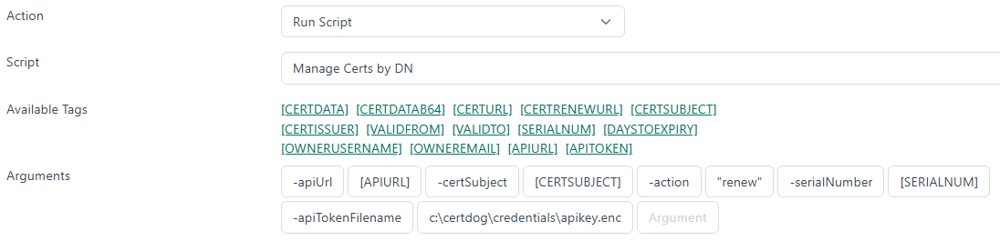

<br>

# Only Allowing One DN

<br>

This guide demonstrates how to configure certdog using Scripts and Workflows to only allow one certificate with a particular Distinguished Name (DN) in the system, marking all other instances as *Renewed*  

By manipulating the script parameters, this could be varied to:

* Revoke all others instead of marking as renewed
* Ignoring DN component ordering (such that CN=certdog,O=Org,C=GB is considered the same as O=Org,C=GB,CN=certdog)
* Searching for Common Name (CN) - renewing/revoking all other certificates with the same CN

<br>

## 1. Obtain the script

The script used in this demo can be downloaded from GitHub here:

https://github.com/krestfield/certdog-scripts/tree/main/renew-revoke-duplicate-certs

Place this in a suitable location. e.g. ``c:\certdog\scripts``

<br>

## 2. Set the Credentials

As the script will be searching for certificates across users and changing the certificate state, it requires an admin level API key. We will generate this, then encrypt under the LOCAL SYSTEM account  

<br>

Obtain the Microsoft SysInternals PsExec tool from here: 

https://learn.microsoft.com/en-us/sysinternals/downloads/psexec

Unzip and copy somewhere in your path (or update your system path)

<br>

In certdog, navigate to an Admin account (this cannot be the account you are logged in with) and create an API key as described here: https://krestfield.github.io/docs/certdog/users.html#api-tokens

<br>

Open a CMD or PowerShell window as Administrator and type:

```
psexec -s -i powershell.exe
```

Type

```
whoami
```

And confirm it says ``nt authority\system``

<br>

Choose a directory where you will store the protected credentials e.g. ``c:\certdog\credentials`` and run the following to set and create it:

```
$dir = 'C:\certdog\credentials'
New-Item -ItemType Directory -Path $dir -Force | Out-Null
```

<br>

Then run the following to set the API key and encrypt:

```
Read-Host -AsSecureString -Prompt 'API key' | ConvertFrom-SecureString | Set-Content "$dir\apikey.enc"
```

Paste in the API key generated above when prompted

<br>

Then set permissions on this folder:

```
# Only SYSTEM and Administrators may read the folder
icacls $dir /inheritance:r /grant:r 'SYSTEM:(OI)(CI)F' 'Administrators:(OI)(CI)F'
```

This prevents any other user from even accessing the file. The contents are encrypted and can only be decrypted by the LOCAL SYSTEM account

<br>

## 3. Upload the Script

From the Scripts menu, upload the script downloaded in step 1 and give it a name e.g. *Manage Certs by DN*. See here for more details on Scripts: https://krestfield.github.io/docs/certdog/scripts.html

<br>

## 4. Configure the Workflow

From the Workflows menu, click Add New Workflow. Give it a name e.g. *Only Allow One DN* and optionally a description  

Set the *Run When* option to **Certificate Issued**

For *Action*, select **Run Script**

For *Script*, select the script uploaded in Step3

For the *Arguments*, set as follows:

```
-apiUrl [APIURL] -certSubject [CERTSUBJECT] -action "renew" -serialNumber [SERIALNUM] -apiTokenFilename c:\certdog\credentials\apikey.enc
```

Note: ``-apiTokenFilename`` must be the same directory and filename as set in step 3 above

E.g.



Click **Add**

<br>

## Testing

Issue a certificate. Copy the DN used. Then issue another certificate (do not use the *Renew* option). Check your inventory. The first certificate should now be marked as *Renewed*, with only the latest certificate showing as *Active*  

If the expected results are not seen check the local log file ``c:\certdog\logs\certdog.log`` which should output information such as the following:

```
2026-09-30 17:06:45.152 DEBUG certdogapi - [certdog@krestfield.com] Workflow 'Only Allow One DN'. Running script with ID: '6abd20e76897b34609cb6186'
2026-09-30 17:06:45.160 DEBUG certdogapi - [certdog@krestfield.com] Running script 'Manage Certs by DN'. Command: powershell.exe -File C:\certdog\scripts\work\6abd20e76897b34609cb6186.ps1 -apiUrl https://krestfield-2025.krestfield.local/certdog/api/ -certSubject CN=test,O=org,OU=unit,C=GB -action "renew" -serialNumber 518badae52f196b756c0769387ba8e93 -apiTokenFilename c:\certdog\credentials\apikey.enc
2026-09-30 17:06:45.472 INFO  certdogapi - [admin] Received request to update certificate attributes to: {
  "renewed" : true
}
2026-09-30 17:06:45.489 DEBUG certdogapi - Script 'Manage Certs by DN' exited with code 0 with output:
  - Skipping (excluded serial number): id=6abd33956897b34609cb62f2 serial=518badae52f196b756c0769387ba8e93 subject='CN=test,O=org,OU=unit,C=GB'
Found 1 valid certificate with the same DN of CN=test,O=org,OU=unit,C=GB. Marking as renewed.
  - Marked as renewed: id=6abd33906897b34609cb62e6 serial=76a890ab30ce26340441e0f8f20874d6 subject='CN=test,O=org,OU=unit,C=GB'
```

<br>

## Options

If you want to catch equivalent DNs, that have the same fields, data but just different ordering e.g. such that this DN:

```
CN=data1.certdog.org,O=certdog,OU=dev,C=GB
```

Is considered the same as:

```
CN=data1.certdog.org,OU=dev,O=certdog,C=GB
```

Then just specify the ``-ignoreRdnOrder`` switch

<br>

If you want to just detect the same CN - regardless of what the other components are e.g. 

```
CN=certdog.user1,OU=IT,O=Krestfield,C=GB
```

Will match against:

```
CN=certdog.user1,OU=Engineering,O=Krestfield,C=GB
```

Then just specify the ``-compareCNOnly`` switch


