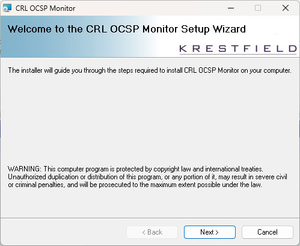
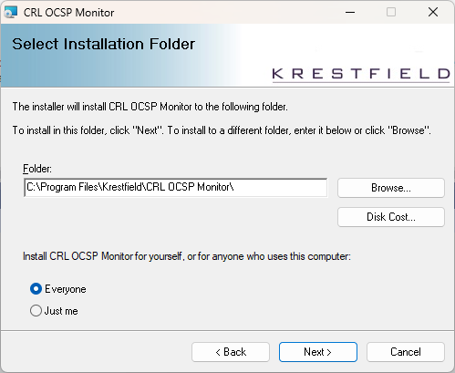
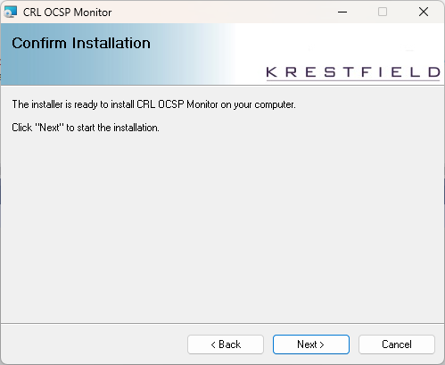
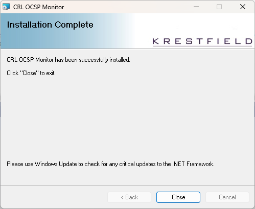

# CRL OCSP Monitor - Installation

 

The following steps outline the steps required to install the CRL OCSP Monitor

 

Pre-requisites

The system may be installed on the following operating systems:  

* Windows Server 2019

* Windows Server 2022

* Windows Server 2025

* Windows 10/11 [^1]

 

The following components are required:

* .NET 4.8 Runtime

 

You must have local Administrator privileges on the system

 

### 1.  Download

Download the free version from [here](https://krestfield.s3.eu-west-2.amazonaws.com/trial/SetupOCSPMonitorFreeV2.0.msi)  

For the supported version, you will be sent details on how to download

 

### 1.1 Install

Double click the *SetupOCSPMonitor* msi file (e.g. **SetupOCSPMonitorV2.3.msi**) 

Click **Next** throughout the screens

Click **Next**

Click **Next**

Click **Close**

