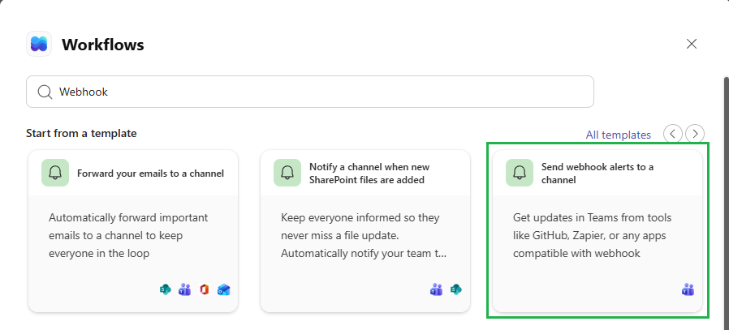
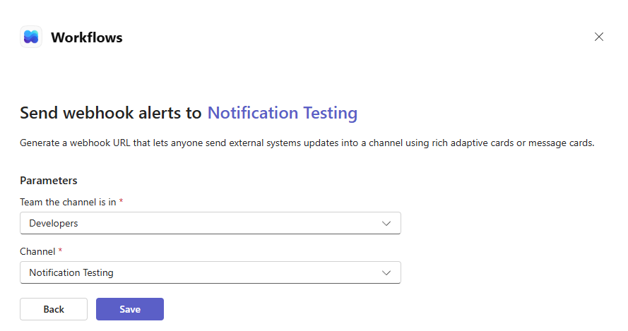
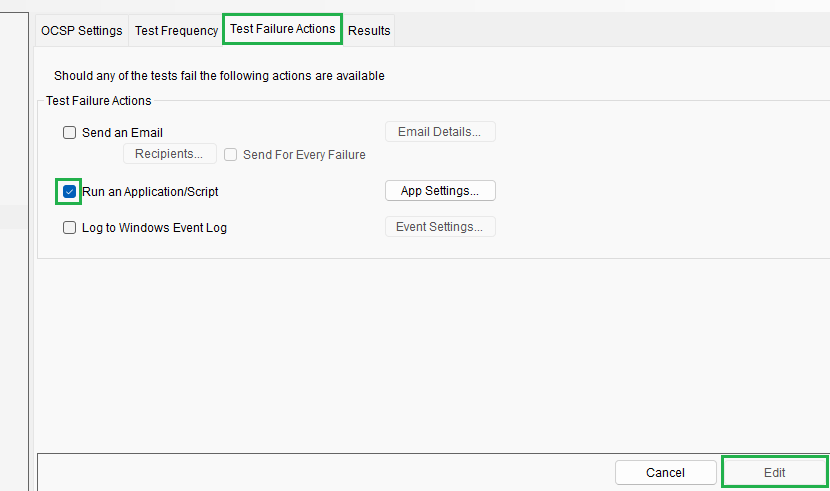
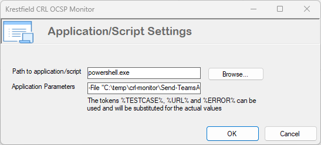
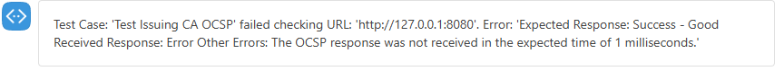
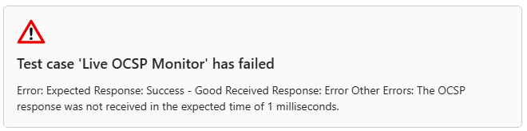

# Setting up Microsoft Teams Alerts

<br>

The CRL OCSP Monitor can be configured to run a script when a test case fails. In this example we'll go through the steps to create a simple PowerShell script that will call a webhook to send an Alert to a channel  in Microsoft Teams.

<br>

### Step 1: Create the webhook in Teams

From **Teams**, select the ellipses (**...**) next to your *Teams Channel* and choose **Workflows**:


From the *Workflows* window, under *Start from a template*, scroll along until you find the workflow **Send webhook alerts to a channel**:



Click on this Workflow.

In the next screen confirm the *Team* and *Channel*, update if required:



Click **Save**


The webhook will be created. Click the Copy webhook link and save to a text file as we'll need it in the following steps.

<br>

### Step 2: Create the PowerShell script

Paste the following into a PowerShell file called Send-TeamsAlert.ps1 (or similar):

```powershell
param([string] $Message)

$script:ModuleRoot = Split-Path -Parent $MyInvocation.MyCommand.Definition
$script:LogFile = Join-Path $ModuleRoot "teamsalertlog.txt"
$script:TeamsWebhookUrl = "ENTER TEAMS WEBHOOK URL HERE"

function Write-Log {
    param([string] $Message)
    $timestamp = (Get-Date).ToString("yyyy-MM-dd HH:mm:ss")
    "$timestamp  $Message" | Out-File -FilePath $script:LogFile -Append -Encoding utf8
}

function Send-TeamsAlert {
    param([string] $Message, [string] $WebhookUrl)

    if (-not $WebhookUrl) { return }

    try {
        $payload = @{ text = $Message } | ConvertTo-Json
        Invoke-RestMethod -Method Post -Uri $WebhookUrl -Body $payload -ContentType "application/json"
        Write-Log "Successfully sent Teams alert containing message: $Message"
    }
    catch {
        Write-Log "Failed to send Teams alert containing message: $Message Error: $_"
    }
}

Send-TeamsAlert -WebhookUrl $script:TeamsWebhookUrl -Message $Message
```

Paste in your webhook URL obtained from the step above where it says "ENTER TEAMS WEBHOOK URL HERE"

E.g.

```powershell
$script:TeamsWebhookUrl = "https://krestfield.webhook.office.com/webhookb2/08c30e55-d4c1-42b3-9c01-dce32f50fb0e@0e285201-65f1-296e-1915-2008a8864591/IncomingWebhook/dceb0b5e720a44eaa9aee56f01a60947/830c24b9-f442-4cfc-9081-71c172765395/V2u6ysB6am72GTuLXwNW9onoU3S311DvdGLz0M2PmAvtf1"
```

<br>

### Step 3: Test the Script

To ensure the webhook is operating OK, open a PowerShell window and navigate to the location of the Send-TeamsAlert.ps1 script

Run:

```powershell
.\Send-TeamsAlert.ps1 -Message "This is a test"
```

In the *Teams channel* you should see:


If there are any failures they should be output to the screen or written to the ``teamsalertlog.txt`` file

<br>

### Step 4: Configure the CRL OCSP Monitor Test Case

Select your *Test Case* from the left hand menu. Select the **Test Failure Actions** tab, click **Edit** and check the **Run an Application Script** check box:



Click the App Settings... button to bring up the Settings dialog:



Populate as follows:

Path to application/script: ``powershell.exe``

Application Parameters: 
```powershell
-File "C:\temp\crl-monitor\Send-TeamsAlert.ps1" -Message "Test Case: %TESTCASE% failed checking URL: %URL%. Error: %ERROR%"
```

Noting:

The location ``C:\temp\crl-monitor\Send-TeamsAlert.ps1`` is wherever your script resides

The message can be whatever you want. The tags: can be used but  are not required.

Click **OK** the **Apply** back on the main screen

<br>

### Step 5: Test

In the test case, make a change on the *OCSP Settings* (or *CRL Settings*) to force the test case to fail. E.g:

* You could change the URL of the CRL or OCSP Responder to an invalid one

* If your CRL is expected to have a lifetime of 5 days. Set the CRL must have a lifetime of More Than 10 days

* You could set the size to be an unrealistic value e.g. less than 1kb

* If your OCSP signing certificate has a 1 month lifetime, set the Fail if signer certificate expiring in less than to 60 days

etc.

Click Edit to make the change, update then click Apply. The change will be recognised in the next few seconds - you do not have to restart the service

You should get a Teams alert such as:



This proves that the alert is working as expected

Revert the change made above

<br>

## Expanding Messages

This can be further expanding by updating the PowerShell script to accept the individual items (Test Case, URL and Error) and formatting as an Adaptive Card. Adaptive Cards can contain formatted text, images, links and other media

You can then achieve Teams alerts such as:



Adaptive cards can be designed using [this tool](https://adaptivecards.microsoft.com/designer)

But there are a couple of points to note:

Teams only supports Adaptive Cards up to version 1.4. Usually you simply just replace the version (from 1.6 to 1.4)

The JSON provided by that tool has to be included in a wrapper. For example, if the tool outputs this JSON:

```json
{
    "type": "AdaptiveCard",
    "$schema": "https://adaptivecards.io/schemas/adaptive-card.json",
    "version": "1.6",
    "body": [        
        {
            "type": "TextBlock",
            "text": "Test case 'Live OCSP Monitor' has failed",
            "wrap": true,
            "style": "heading"
        }
    ]
}
```

It needs to be wrapped in:

```json
{
	"contentType" : "application/vnd.microsoft.card.adaptive",
	"content" : {
		[ TOOL OUTPUT HERE ]
	}
}
```

And the version changed to 1.4. So the full output would be:

```json
{
	"contentType" : "application/vnd.microsoft.card.adaptive",
	"content" : {
        "type": "AdaptiveCard",
        "$schema": "https://adaptivecards.io/schemas/adaptive-card.json",
        "version": "1.4",
        "body": [        
            {
                "type": "TextBlock",
                "text": "Test case 'Live OCSP Monitor' has failed",
                "wrap": true,
                "style": "heading"
            }
       ]
    }
}
```


