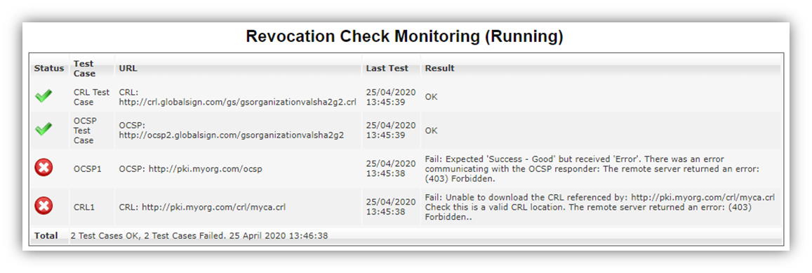
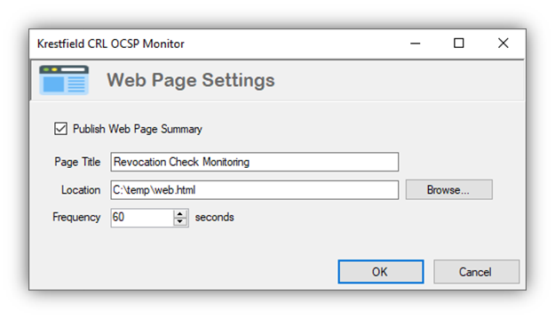

# CRL OCSP Monitor - Web Page Summary

 

For high level monitoring an html status page can be configured to display status information which is continually updated. An example of this is shown below:

In order to configure this click the ![img](data:image/png;base64,/9j/4AAQSkZJRgABAQEAYABgAAD/2wBDAAoHBwgHBgoICAgLCgoLDhgQDg0NDh0VFhEYIx8lJCIfIiEmKzcvJik0KSEiMEExNDk7Pj4+JS5ESUM8SDc9Pjv/2wBDAQoLCw4NDhwQEBw7KCIoOzs7Ozs7Ozs7Ozs7Ozs7Ozs7Ozs7Ozs7Ozs7Ozs7Ozs7Ozs7Ozs7Ozs7Ozs7Ozs7Ozv/wAARCAAYABcDASIAAhEBAxEB/8QAHwAAAQUBAQEBAQEAAAAAAAAAAAECAwQFBgcICQoL/8QAtRAAAgEDAwIEAwUFBAQAAAF9AQIDAAQRBRIhMUEGE1FhByJxFDKBkaEII0KxwRVS0fAkM2JyggkKFhcYGRolJicoKSo0NTY3ODk6Q0RFRkdISUpTVFVWV1hZWmNkZWZnaGlqc3R1dnd4eXqDhIWGh4iJipKTlJWWl5iZmqKjpKWmp6ipqrKztLW2t7i5usLDxMXGx8jJytLT1NXW19jZ2uHi4+Tl5ufo6erx8vP09fb3+Pn6/8QAHwEAAwEBAQEBAQEBAQAAAAAAAAECAwQFBgcICQoL/8QAtREAAgECBAQDBAcFBAQAAQJ3AAECAxEEBSExBhJBUQdhcRMiMoEIFEKRobHBCSMzUvAVYnLRChYkNOEl8RcYGRomJygpKjU2Nzg5OkNERUZHSElKU1RVVldYWVpjZGVmZ2hpanN0dXZ3eHl6goOEhYaHiImKkpOUlZaXmJmaoqOkpaanqKmqsrO0tba3uLm6wsPExcbHyMnK0tPU1dbX2Nna4uPk5ebn6Onq8vP09fb3+Pn6/9oADAMBAAIRAxEAPwDsvFfi2+0XVksrX7Mi+SshedGbcSxHGDxjGaqWXjK9ukkabWtGtSkhRQ9vId4HRh83Q1s+JJ5IJYTE20sOeKoWtxNNbOzP8wcAHA6Y+ldcMK5RU76HFPE8s3Cxo+HNcm1S8vLeS6tLtbdI3We1RlU7s5Ugk8jH60Va0QsYpCxyc9aK56keWTR1U5c0UyTUdLj1F0aRyNo4FV00CKOMxrKQCdxooqo1qkVyp6EujTk+ZrUu2NmLJGUPuDHPSiiis5ScndmkYqKsj//Z) button. The following dialog will be displayed:

Check the **Publish Web Page Summary** check box

Set the page title, the html page location (this could be on a web server or local file system but should be accessible via the browser used to display the information), set the frequency (at which the page will be updated) and click **OK**

An html page with the name specified will now be produced and updated at the interval selected
