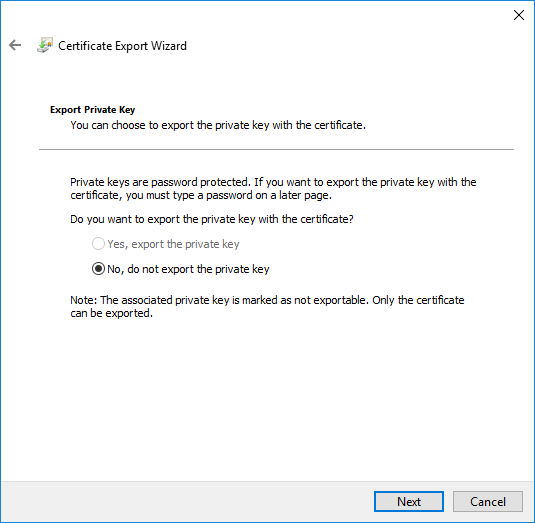
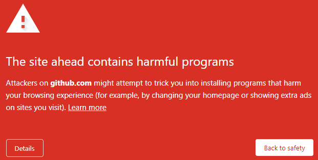
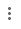
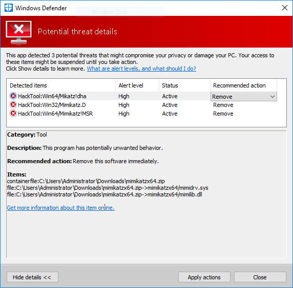
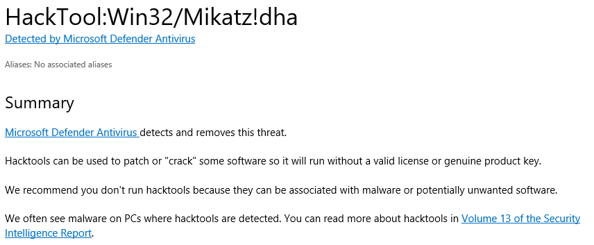
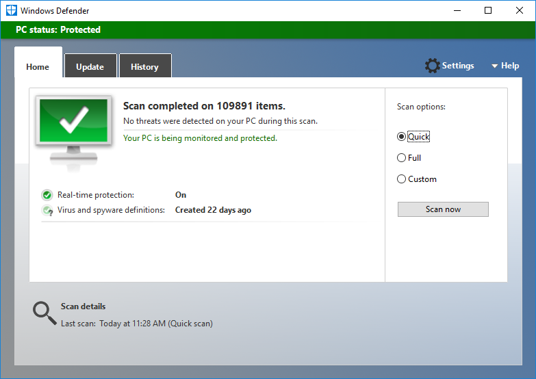

# Exporting a non-exportable certificate (Microsoft)

Certificates within the Microsoft store may have their keys marked as *non-exportable*. Often there is good reason for this - to prevent the certificate from being exported and used elsewhere  

However, there are times when you need to migrate keys to another machine or export into another system. For example, when you wish to migrate your Microsoft CA keys into Certdog  

While attempting to export you will see the following:




I.e. The **Yes, export the private key** is greyed out

However, we can still export these keys...but we need to make use of a tool - called mimikatz that will circumvent the Microsoft protection  

This tool is also able to obtain passwords etc. and is used as an offensive hacking tool. Widely known, everything will bark at you when attempting to download/use, including your browser and Windows Defender (and any anti-virus software) 

The steps below provide details on how to temporarily disable these protections. You need administrator privileges and to be able to override your security settings. This should all be performed at your own risk. If in any doubt research the mimikatz tool and if a customer, feel free to contact [Krestfield support](mailto:support@krestfield.com) for more details or assistance  

<br>

### Step 1: Obtain the Tool

Download the tool from here: [https://github.com/gentilkiwi/mimikatz/releases](https://github.com/gentilkiwi/mimikatz/releases)

Download the ``mimikatz_trunk.zip`` file

If you see something like the following (this screen shot is from Chrome):



You will need to disable *Safe Browsing*. From Chrome, click the  menu and select **Settings**  

Select **Privacy and security**, then select **Security** and under *Safe Browsing*, select **No protection (not recommended)** and confirm. Note what you did as you should reverse this once you have exported the certificate

Now if you attempt to download, it may still fail. You may see an error such as: *Failed - Virus detected*. In this case Microsoft Defender has blocked  

Open **Windows Defender** and click **Settings** and set *Real-time protection* to **Off**

Now retry the download, which, if you have managed to switch off all the anti-virus protections, should now succeed. Again, remember this protection should be re-enabled once the export is complete

You can still check the status of the download by right-clicking the zip and click **Scan with Windows Defender**. Click **Show details** You'll see something like the following:



Follow the link to find out more about mimkatz. You may see a page as follows which provides more information:

 

<br>

### Step 2: Run

Unzip the downloaded zip file and extract  

Open a command prompt and navigate to`` [unzip location]\x64`` 

We will start mimikatz:

```
mimikaz
```

 Then run the following commands:

```
crypto::capi
privilege::debug
crypto::cng
crypto::certificates /systemstore:local_machine /store:my /export
```

This will export all certificates from the Local Machine store into the current folder. Certificates in each PFX file will be extracted as well as the PFX itself. For example:

```powershell
11/04/2021  10:00 AM             1,445 local_machine_my_0_Krestfield Root.der
11/04/2021  10:00 AM             1,685 local_machine_my_1_Certdog.der
11/04/2021  10:00 AM             4,518 local_machine_my_1_Certdog.pfx
```

The password for the PFX files is: ``mimikatz``

These PFX files can now migrated to another machine

Example: 

```powershell
C:\Users\Administrator\Downloads\mimikatzx64>mimikatz.exe

  .#####.   mimikatz 2.2.0 (x64) #19041 Aug 10 2021 17:19:53
 .## ^ ##.  "A La Vie, A L'Amour" - (oe.eo)
 ## / \ ##  /*** Benjamin DELPY `gentilkiwi` ( benjamin@gentilkiwi.com )
 ## \ / ##       > https://blog.gentilkiwi.com/mimikatz
 '## v ##'       Vincent LE TOUX             ( vincent.letoux@gmail.com )
  '#####'        > https://pingcastle.com / https://mysmartlogon.com ***/

mimikatz # crypto::capi
Local CryptoAPI patched

mimikatz # privilege::debug
Privilege '20' OK

mimikatz # crypto::cng
"KeyIso" service patched

mimikatz # crypto::certificates /systemstore:local_machine /store:my /export
 * System Store  : 'local_machine' (0x00020000)
 * Store         : 'my'

 0. Krestfield Root
    Subject  : C=GB, O=Krestfield Ltd, OU=PKI Services, CN=Krestfield Root
    Issuer   : C=GB, O=Krestfield Ltd, OU=PKI Services, CN=Krestfield Root
    Serial   : 2130a1741705c1459e70602dd609065f
    Algorithm: 1.2.840.113549.1.1.1 (RSA)
    Validity : 12/23/2016 12:24:31 PM -> 12/23/2041 12:34:27 PM
    Hash SHA1: 71ae352196e6f3b8a7542b88aca53834708127c3
        Public export  : OK - 'local_machine_my_0_Krestfield Root.der'

 1. Certdog
    Subject  : C=GB, O=Krestfield, CN=Certdog
    Issuer   : C=GB, O=Krestfield Ltd, OU=PKI Services, CN=Krestfield Root
    Serial   : 25000000000064e89faebf6894622500000038
    Algorithm: 1.2.840.113549.1.1.1 (RSA)
    Validity : 2/24/2021 8:42:34 PM -> 2/19/2041 8:42:34 PM
    Hash SHA1: 4a43f6901eabbfd4846e41d4c5fe1a543ad3bc99
        Key Container  : Certdog
        Provider       : Microsoft Software Key Storage Provider
        Provider type  : cng (0)
        Type           : CNG Key (0xffffffff)
        |Provider name : Microsoft Software Key Storage Provider
        |Implementation: NCRYPT_IMPL_SOFTWARE_FLAG ;
        Key Container  : Certdog
        Unique name    : f89b6c40e7e10e2d08c41426b121cda0_7887b6c3-ad12-4fa6-bf71-2c5ae4a7bfb1
        Algorithm      : RSA
        Key size       : 4096 (0x00001000)
        Export policy  : 00000000 ( )
        Exportable key : NO
        Public export  : OK - 'local_machine_my_1_Certdog.der'
        Private export : OK - 'local_machine_my_1_Certdog.pfx'
```

<br>

### Step 3: Clean Up

Once you have the PFX file you require 

* Remove the mimikatz tool from your system (delete the directory)

* Re-enable your anti-virus e.g. Microsoft Defender Real-time protection

* Re-enable Chrome/Browser protection (Chrome Safe browsing)

For peace of mind, run a scan:



